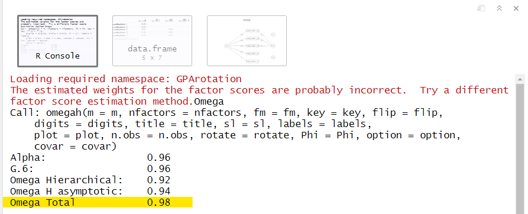

```{r child = "setup.Rmd"}
```
```{r packages, include = F, eval = T}
library(tidyverse) ## because tidyverse = life
library(skimr) ## looking at the data
library(summarytools) ## looking at the data
library(broom) ## for extracting output using broom
library(janitor) ## for chi-square: tabyl for chi-squares
library(lm.beta) ## for regression: standardized coefficients
library(psych) ## for reliability: omega and alpha
library(apa) ## for reporting results in APA format
library(ggpubr) ## for qq plots
library(rstatix) ## for shapiro_test that is pipe-friendly

college <- read_csv("../data/college.csv")
```

class: center, middle, dk-section-title
background-image: url(images/welcome.jpg)

# Welcome to the course!

---

class: bottom, center
background-image: url(images/r_first.png)

.small[Image by [Allison Horst](https://github.com/allisonhorst/stats-illustrations)]

---

class: bottom, center
background-image: url(images/r_then.png)


.small[Image by [Allison Horst](https://github.com/allisonhorst/stats-illustrations)]

---

## What you will learn in this course

--

1. t-tests: independent and dependent

--

2. ANOVA: mainly the one-way ANOVA

--

3. chi-square

--

4. correlation

--

5. regression

--

6. reliability (internal consistency)

--

7. reporting statistics in R

--

8. testing parametric assumptions


???

This course will cover seven topics. 
1. First, we're going to learn four main inferential statistics...

5. We'll also learn how to conduct reliability such as Cronbach's alpha, a measure of internal consistency.

6. Then we'll learn how to report statistics in R through learning how to extract values from the summary output, tidying up the results, and using packages to report statistics easily.

7. Lastly, we'll cover how to test assumptions of your parametric tests and what to do if you do not meet the assumptions of normally distributed data. 


---

## What you will need for this course

--

1. R and RStudio!

--

2. Dataset: college.csv

--

3. Packages:
+ tidyverse
+ broom
+ rstatix
+ janitor
+ correlation
+ lm.beta
+ psych
+ and more!

???

library(tidyverse) ## because tidyverse = life  
library(broom) ## for extracting output using broom  
library(rstatix) ## for tidyverse-friendly stats
library(janitor) ## for chi-square: tabyl for chi-squares  
library(correlation) ## for correlation: tidy correlation results  
library(lm.beta) ## for regression: standardized coefficients  
library(psych) ## for reliability: omega and alpha  

---

## A quick overview of tidyverse

There are a few tidyverse functions we'll use:

--

- `dplyr::select()`

--


- `dplyr::filter()`

--

- `dplyr::mutate()`

--

- `tidyr::pivot_longer()`

---

## How this course will work

--

- Each video will walk through the topic, showing you relevant R code and output.

--

- At the end of each video will be an opportunity for you to practice what you've learned. 

--

- You can check your answers to the Your Turn activities on the R for the Rest of Us website. 

---

background-image: url(images/data.jpg)
class: center, middle, dk-section-title

# Introduction to the dataset

---

## college.csv

```{r eval = TRUE}
college <- read_csv("../data/college.csv")

college 
```

---

```{r eval = TRUE, echo = FALSE, results = 'asis'}
st_css()
print(dfSummary(college[2:5], style = "grid", valid.col = FALSE, caption = FALSE, graph.magnif = 1.2,
                varnumbers = FALSE, na.col = FALSE, headings = FALSE), method = 'render')
```

---

```{r eval = TRUE, echo = FALSE, results = 'asis'}
st_css()
print(dfSummary(college[6:9], style = "grid", valid.col = FALSE, caption = FALSE, graph.magnif = 1.2,
                varnumbers = FALSE, na.col = FALSE, headings = FALSE), method = 'render')
```

---

```{r eval = TRUE, echo = FALSE, results = 'asis'}
st_css()
print(dfSummary(college[c(10:11, 14)], style = "grid", valid.col = FALSE, caption = FALSE,
                varnumbers = FALSE, na.col = FALSE, headings = FALSE), method = 'render')
```

---

```{r eval = TRUE, echo = FALSE, results = 'asis'}
st_css()
print(dfSummary(college[15:18], style = "grid", valid.col = FALSE, caption = FALSE,
                varnumbers = FALSE, na.col = FALSE, headings = FALSE), method = 'render')
```

---

## Satisfaction with Life Scale

```{r eval = TRUE, echo = FALSE, results = 'asis', rows.print = 10}
college %>%
  select(19:28) %>%
  summarytools::descr(., stats = c("mean", "min", "max"), headings = FALSE) %>%
  tb()
```


---

```{r eval = TRUE, echo = FALSE, results = 'asis'}
st_css()
print(dfSummary(college[29:31], style = "grid", valid.col = FALSE, caption = FALSE,
                varnumbers = FALSE, na.col = FALSE, headings = FALSE), method = 'render')
```

---

class:inverse

## Your Turn

You'll be working with the college dataset to run all your analyses. 

--

1. Create a new project. Make sure you put it somehwere you'll be able to find it again later!

--

1. Download the dataset "college.csv" from https://bit.ly/college-dataset

--

1. Create a new R script file or RMarkdown document where you'll do all of your inferential statistics

--

1. Import the spreadsheet into a dataframe `college` using `readr::read_csv()`

---

background-image: url(images/independent.jpg)
class: center, middle, dk-section-title

# Independent t-test

---

## Independent vs dependent t-test

.pull-left[
### Independent t-test

- Between-subjects
- Independent samples
- Examine the mean difference between two unrelated groups (e.g., males and females, a group of mothers and a group of daughters)
]

--

.pull-right[
### Dependent t-test

- Within-subjects
- Dependent or paired samples
- Examine the mean difference between two related groups (e.g., same group at two time points, pairs of mothers and daughters)
]

--

Both t-tests are performed using the `t_test()` function in the **`rstatix`** package.

---

## Independent t-test in R

```{r}
dat %>%
  t_test(DV ~ IV)
```

???

This is the basic syntax of the independent t-test using the tidyverse. 

---

## An example

Let's try running an independent samples t-test with our `college` dataset. 

--

Let's test whether weight at time 2 differs by smoking status. 

--

.pull-left[
```{r}
dat %>%
  t_test(DV ~ IV)
```
]

--

.pull-right[
```{r}
college %>%
  t_test(weight_2 ~ smokes)
```
]

--

```{r eval = TRUE, echo = FALSE}
college %>%
  t_test(weight_2 ~ smokes)
```

--

Notice the degrees of freedom has decimals. This is because the `t_test()` function defaults to var.equal = FALSE.

---

## Variances equal

```{r}
college %>%
  t_test(weight_2 ~ smokes, `var.equal = TRUE`)
```

???

Add the argument `var.equal = TRUE` to specify that we assume the variances between groups is equal.

--

```{r eval = TRUE, echo = FALSE}
college %>%
  t_test(weight_2 ~ smokes, var.equal = TRUE)
```

---

## Detailed t-test results

You can also asked for detailed results.

```{r}
college %>%
  t_test(weight_2 ~ smokes, 
         `detailed = TRUE`)
```

--

```{r eval = TRUE, echo = FALSE}
college %>%
  t_test(weight_2 ~ smokes, 
         detailed = TRUE)
```

???

Adds the mean values of the two groups and the mean difference between the two groups, what method was used, the alternative hypothesis, and the confidence intervals.

Notice how it says that the variances are unequal. 


---

## Alternative hypothesis

The default alternative hypothesis is a **two-sided hypothesis** that the mean difference is not equal to 0. 

```{r}
college %>%
  t_test(weight_2 ~ smokes, var.equal = TRUE, `alternative = "two.sided"`)
```

--

What if you have a **one-sided hypothesis**? 

--

```{r}
college %>%
  t_test(weight_2 ~ smokes, var.equal = TRUE, `alternative = "greater"`)
```

```{r}
college %>%
  t_test(weight_2 ~ smokes, var.equal = TRUE, `alternative = "less"`)
```

???

The alternative argument lets you specify either **less** or **greater** than 0. 

---

## Alternative hypothesis

```{r}
college %>%
  t_test(weight_2 ~ smokes, var.equal = TRUE, detailed = TRUE, `alternative = "two.sided"`)
```

```{r, eval = TRUE, echo = FALSE}
college %>%
  t_test(weight_2 ~ smokes, var.equal = TRUE, detailed = TRUE, alternative = "two.sided")
```

```{r}
college %>%
  t_test(weight_2 ~ smokes, var.equal = TRUE, detailed = TRUE, `alternative = "greater"`) 
```

```{r, eval = TRUE, echo = FALSE}
college %>%
  t_test(weight_2 ~ smokes, var.equal = TRUE, detailed = TRUE, alternative = "greater") 
```

???

Notice that the p-value is half of the previous value. 

---

## Other arguments in the t-test
```{r}
college %>%
  t_test(weight_2 ~ smokes, detailed = TRUE, `mu = 1`)
```

--

```{r eval = TRUE, echo = FALSE}
college %>%
  t_test(weight_2 ~ smokes, detailed = TRUE, mu = 1)
```

???

mu is a greek symbol for the population mean, or in this case the mean difference that we're testing for. It defaults at 0, but you can change it to any value to test whether the mean difference is mu.

--

```{r}
college %>%
  t_test(weight_2 ~ smokes, detailed = TRUE, `conf.level = .99`)
```

--

```{r eval = TRUE, echo = FALSE}
college %>%
  t_test(weight_2 ~ smokes, detailed = TRUE, conf.level = .99)
```

???

You can also adjust the confidence intervals to be from the default 95% confidence interval to something else, such as a 99% confidence interval.

---

class: inverse

## Your Turn

--

1. Perform an independent samples t-test to test whether there is a difference in `exam_1` by `athlete`. Use `var.equal = TRUE`. Is there a difference? What is the p-value? 

--

1. Perform an independent samples t-test to test whether there is a difference in `act_english` by `gender`. Use `var.equal = TRUE`. Is there a difference? What is the p-value? 

Notice what happens since gender has 3 levels. Try out using the `filter()` function from dplyr to only check the difference between Female and Male students. Alternatively, check out the page on `t_test()` to see how to use the `comparisons` argument to specify the groups to compare.

```{r, include = FALSE}

### T-TEST ANSWERS

## 2 ##
college %>%
  t_test(exam_1 ~ athlete, var.equal = TRUE)

## 3 ##
college %>%
  filter(gender != "Trans*") %>%
  t_test(act_english ~ gender, var.equal = FALSE)

## Alternative 3: this is not covered ##
college %>%
  t_test(act_english ~ gender, var.equal = FALSE,
         comparisons = list(c("Male", "Female")))

```

---

background-image: url(images/dependent.jpg)
class: center, middle, dk-section-title

# Dependent t-test

---

## Independent vs dependent t-test

.pull-left[
### Independent t-test

- Between-subjects
- Independent samples
- Examine the mean difference between two unrelated groups (e.g., males and females, a group of mothers and a group of daughters)
]

.pull-right[
### Dependent t-test

- Within-subjects
- Dependent or paired samples
- Examine the mean difference between two related groups (e.g., same group at two time points, pairs of mothers and daughters)
]

---

## Dependent t-test in R

The dependent t-test adds a new argument to the `t_test()` function: 

.center[`paired = TRUE`]

```{r}
dat %>%
  t_test(DV ~ IV, `paired = TRUE`)
```

???

This is the basic syntax of the dependent t-test using the tidyverse. Notice the inclusion of paired = TRUE argument. This tells R the data is a paired samples or dependent samples t-test. 

Unfortunately, data *has* to be in long format. Often dependent t-test data is in wide format. So we'll cover how to convert data to long format easily.

---

## Converting wide to long format

Let's test the difference in means between `weight_1` and `weight_2`.

--

```{r}
college %>%
  select(weight_1, weight_2) %>%
  pivot_longer(cols = everything(), 
               names_prefix = "weight_",
               names_to = "time",
               values_to = "weight",)
```

--

```{r eval = TRUE, echo = FALSE}
college %>%
  select(weight_1, weight_2) %>%
  pivot_longer(cols = everything(), 
               names_prefix = "weight_",
               names_to = "time",
               values_to = "weight",)
```

---

## Dependent t-test in R

```{r}
college %>%
  select(weight_1, weight_2) %>%
  pivot_longer(cols = everything(), 
               names_to = "time",
               values_to = "weight",
               names_prefix = "weight_") %>%
  t_test(weight ~ time, paired = TRUE) #<<
```

--

```{r eval = TRUE, echo = FALSE}
college %>%
  select(weight_1, weight_2) %>%
  pivot_longer(cols = everything(), 
               names_to = "time",
               values_to = "weight",
               names_prefix = "weight_") %>%
  t_test(weight ~ time, paired = TRUE) #<<
```

---

class: inverse

## Your Turn

--

1. Perform a  dependent samples t-test to test whether there is a difference in exam scores: `exam_1` and `exam_2`. Is there a difference? What is the p-value? 

--

1. Perform a dependent samples t-test to test whether there is a difference in `act_science` and `act_mathematics` scores. Is there a difference? What is the p-value?

--

Don't forget: You'll need to make your data long before running your t-test.

```{r, include = FALSE}

### T-TEST ANSWERS

## 2 ##
college %>%
  select(exam_1, exam_2) %>%
  pivot_longer(cols = everything(), 
               names_to = "exam",
               values_to = "score",
               names_prefix = "weight_") %>%
  t_test(score ~ exam, paired = TRUE)

## 3 ##
college %>%
  select(act_science, act_mathematics) %>%
  pivot_longer(cols = everything(), 
               names_to = "act_test",
               values_to = "score",
               names_prefix = "weight_") %>%
  t_test(score ~ act_test, paired = TRUE)

```


---

background-image:url(images/one_way.jpg)
class: center, middle, dk-section-title

# One-way ANOVA

---

## One-way ANOVA

- Between-subjects

--

- Independent samples

--

- Examine the mean difference between **three or more** unrelated groups

--

- Tests the null hypothesis that the three or more means are the same

--

- To know *where* the mean differences are, we need planned contrasts or post-hoc procedures like Tukey's HSD (we'll cover that in the next video)

---

## One-way ANOVA in R

The formatting for the one-way ANOVA is similar to that of `t_test()` except we replace it with `anova_test`.

--

```{r}
dat %>%
  `anova_test`(DV ~ IV)
```

---

## An example

Let's try running an one-way ANOVA with our `college` dataset. 

--

Let's test whether exam 1 scores differ by grade rank (`grade_class`).

--

.pull-left[ 
```{r}
dat %>%
  anova_test(DV ~ IV)
```
]

--

.pull-right[ 
```{r}
college %>%
  anova_test(exam_1 ~ grade_class)
```
]

--

```{r eval = TRUE, echo = FALSE}
college %>%
  anova_test(exam_1 ~ grade_class)
```

---

## Detailed ANOVA results

```{r, eval = TRUE}
college %>% 
  anova_test(exam_1 ~ grade_class)
```

--

```{r}
college %>% 
  anova_test(exam_1 ~ grade_class, `detailed = TRUE`)
```

--

```{r eval = TRUE, echo = FALSE}
college %>%
  anova_test(exam_1 ~ grade_class, detailed = TRUE)
```

---

## hccm???

```{r message = TRUE, eval = TRUE, warning = TRUE}
college %>%
  anova_test(exam_1 ~ grade_class)
```

--

The warning `Coefficient covariances computed by hccm()` just tells us that it is using a heteroscedasticity-corrected coefficient covariance matrix. 

Nothing for us to worry about!

---

## Effect sizes

`ges` is generalized eta squared. We can change `effect.size = "pes"` for partial eta squared.

--

.pull-left[
```{r eval = TRUE}
college %>%
  anova_test(exam_1 ~ grade_class, 
             effect.size = "ges") #<<
```
]

--

.pull-left[
```{r eval = TRUE}
college %>%
  anova_test(exam_1 ~ grade_class, 
             effect.size = "pes") #<<
```
]

---

class: inverse

## Your Turn

--

1. Perform a one-way ANOVA to test whether there is a difference in `hs_gpa` by `grade_class`. Is there a difference? What is the p-value? 

--

1. Perform a one-way ANOVA to test whether there is a difference in `act_english` by `race`. Is there a difference? What is the p-value? 

```{r include = FALSE}

### ONE-WAY ANOVA ANSWERS

## 2 ##
college %>%
  anova_test(hs_gpa ~ grade_class)

## 3 ##
college %>%
  anova_test(act_english ~ race)
```

---

background-image:url(images/compare.jpg)
class: center, middle, dk-section-title

# Post hoc comparisons

---

## Post hoc comparisons

The one-way ANOVA tests the null hypothesis that there is no mean difference between the 3+ groups. If the one-way ANOVA is statistically significant, it does not tell us *where* the differences lie.

--

For that, we need post hoc comparisons.*

--

.small[There are many post hoc comparisons possible (e.g., Fisher's LSD, Bonferroni, Newman-Keuls, Scheffe), but we're going to focus on **Tukey's HSD** because it and does a good job protecting against Type I errors without being too conservative.]

???

Tukey's Honest Significant Differences

---

## Tukey's HSD

```{r}
dat %>%
  `tukey_hsd`(DV ~ IV)
```

---

## An example

Using our previous example, let's run Tukey's HSD by testing whether exam 1 scores differ by grade rank (`grade_class`).
.pull-left[
```{r}
dat %>%
  `tukey_hsd`(DV ~ IV)
```
]

--

.pull-right[
```{r}
college %>%
  tukey_hsd(exam_1 ~ grade_class)
```
]

--

```{r eval = TRUE, echo = FALSE, rows.print = 10}
college %>%
  tukey_hsd(exam_1 ~ grade_class)
```

---

class: inverse

## Your Turn

--

1. Perform one-way ANOVA to test whether there is a difference in `hs_gpa` by `grade_class`. Is there a difference? If so, perform a Tukey's HSD to test where the differences are. Describe the differences.

--

1. Perform one-way ANOVA to test whether there is a difference in `weight_2` by `gender`. Is there a difference? If so, perform a Tukey's HSD to test where the differences are. Describe the differences. 

```{r include = FALSE}

### ONE-WAY ANOVA ANSWERS

## 2 ##
college %>%
  anova_test(hs_gpa ~ grade_class)

college %>%
  tukey_hsd(hs_gpa ~ grade_class)

## 3 ##
college %>%
  anova_test(weight_2 ~ gender)

college %>%
  tukey_hsd(weight_2 ~ gender)

```

---

background-image:url(images/pattern.jpg)
class: center, middle, dk-section-title

# Other ANOVA tests

---

## Repeated measures ANOVA

Repeated Measures ANOVA allows us to examine designs in which the same people or samples contributed to the different means (within-groups design). 

This means that all participants or cases participated in all conditions of an experiment or IV. 

---

## Repeated measures ANOVA in R

There are two ways to write the R code for a repeated measures ANOVA using `anova_test`: by the equation, or by specifying which variables are the DV, between- or within-subjects IVs, and wid (within-subjects identifier).

--

**Option 1**:

```{r}
dat %>%
  anova_test(DV ~ IV + Error(id/IV))
```

--

**Option 2**:

```{r}
dat %>%
  anova_test(dv = DV, wid = id, within = IV)
```

---

## An example

Let's examine how exam scores (`exam_1`, `exam_2`, and `exam_3`) differ within individuals across time. 

Notice that we'll need to make our data into *long format* to make this work, since we need the DV into into variable. 

--

**pivot_longer**:
```{r}
college %>%
  select(starts_with("exam"), id) %>%
  pivot_longer(-id, 
               names_to = "exam",
               values_to = "score",
               names_prefix = "exam_")
```

---

## An example: Option 1

```{r}
college %>%
  select(exam_1:exam_3, id) %>%
  pivot_longer(-id, names_to = "exam", values_to = "score", names_prefix = "exam_") %>%
  anova_test(score ~ exam + Error(id/exam)) #<<
```

--

```{r eval = TRUE, echo = FALSE}
college %>%
  select(exam_1:exam_3, id) %>%
  pivot_longer(-id, names_to = "exam", values_to = "score", names_prefix = "exam_") %>%
  anova_test(score ~ exam + Error(id/exam))
```

---

## An example: Option 2

```{r}
college %>%
  select(exam_1:exam_3, id) %>%
  pivot_longer(-id, names_to = "exam", values_to = "score", names_prefix = "exam_") %>%
  anova_test(dv = score, wid = id, within = exam) #<<
```

--

```{r eval = TRUE, echo = FALSE}
college %>%
  select(exam_1:exam_3, id) %>%
  pivot_longer(-id, names_to = "exam", values_to = "score", names_prefix = "exam_") %>%
  anova_test(dv = score, wid = id, within = exam)
```

---

## Factorial ANOVA

Factorial ANOVA allows us to examine two or more independent variables (IVs) simultaneously. There are several types of factorial designs:

--

- **Independent factorial design**: 2+ between-group (independent) IVs 

--

-	**Repeated measures factorial design**: 2+ within-group (repeated-measures) IVs

--

-	**Mixed factorial design**: 1+ between-group and 1+ within-group IVs

---

## Factorial ANOVA

To perform a factorial ANOVA in R, all you need to do is add more variables to the right hand of the tilde (~) in the ANOVA equation using either a + (does not add an interaction term) or * (adds an interaction term). 

---

## Example independent factorial design

**Formula without interaction**:

```{r, eval = TRUE}
college %>%
  anova_test(hs_gpa ~ grade_class + smokes) # NO INTERACTION
```

---

## Example independent factorial design

**Formula with interaction**:

```{r eval = TRUE}
college %>% 
  anova_test(hs_gpa ~ grade_class * smokes) #  INTERACTION 
```

---

class: inverse

## Your Turn

--

Read more about how to conduct repeated measures and factorial ANOVA designs using the resources on the R for the Rest of Us website.

---

background-image:url(images/square.jpg)
class: center, middle, dk-section-title

# Chi-square

---

## Chi-square

The chi-square test is used to analyze categorical data (data that describe categories of entities). We can't examine categorical data using things like means or medians, so we examine counts instead. 

--

```{r}
college %>% 
  tabyl(smokes, athlete)
```

--

```{r, eval = TRUE, echo = FALSE}
college %>% 
  tabyl(smokes, athlete)
```


---

## Chi-square in R: rstatix

--

```{r}
table(college$smokes, college$athlete) %>%
  chisq_test()
```

--

```{r, eval = TRUE, echo = FALSE}
table(college$smokes, college$athlete) %>%
  chisq_test()
```

---

## Chi-square in R: janitor

```{r}
college %>%
  tabyl(smokes, athlete) %>%
  janitor::chisq.test()
```

--

```{r, eval = TRUE, echo = FALSE}
college %>%
  tabyl(smokes, athlete) %>%
  janitor::chisq.test()
```

--

Solution! Use the `tidy()` function in the *broom* package!

---

class: bottom, center
background-image: url(images/broom_package.png)
background-size: contain

.small[Image by [Allison Horst](https://github.com/allisonhorst/stats-illustrations)]

---

## Chi-square in R: janitor

```{r}
college %>%
  tabyl(smokes, athlete) %>%
  janitor::chisq.test() %>%
  tidy() #<<
```

--

```{r, eval = TRUE, echo = FALSE}
college %>%
  tabyl(smokes, athlete) %>%
  janitor::chisq.test() %>%
  tidy()
```

---

## Standardized residuals

The standardized residuals tell us for that cell if the expected and observed frequency are independent. They are z-scores so values greater than 1.96 are statistically significant (*p* < .05).

--

```{r}
tab <- college %>%
  tabyl(smokes, athlete) %>%
  janitor::chisq.test()

tab$stdres #<<
```

--

```{r, eval = TRUE, echo = FALSE}
tab <- college %>%
  tabyl(smokes, athlete) %>%
  janitor::chisq.test()

tab$stdres
```

---

## Observed and expected counts

Similarly, we can ask for the observed and expected counts.

--

.pull-left[
### Observed
```{r, eval = TRUE}
tab$observed #<<
```
]

--

.pull-left[
### Expected
```{r, eval = TRUE}
tab$expected #<<
```
]

---

class: inverse

## Your Turn

--

1. Perform a chi-square to examine how `grade_class` relates to `live_on_campus`. What is the p-value? Is there a relationship?

--

1. If there is a significant difference, examine standardized residuals and the observed/expected frequencies to determine what grade class is more or less likely to live on campus. Interpret the results.

```{r include = FALSE}

### CHI-SQUARE ANSWERS

## 2 ##
tab2 <- college %>%
  tabyl(grade_class, live_on_campus) %>%
  janitor::chisq.test()

tab2

## 3 ##
tab2$stdres

tab2$observed

tab2$expected
# 
```

---

background-image:url(images/small.jpg)
class: center, middle, dk-section-title

# Dealing with small cells

---

## Dealing with small cells

Sometimes when dealing with small cells, you will get an error that the Chi-square approximation may not be correct. 

--

Example:

```{r, eval = TRUE, warning = TRUE}
college %>%
  filter(smokes == 1) %>%
  tabyl(race, gender) %>%
  chisq.test()
```

--

There are a few things we can do to fix this problem.

---

## 1. Drop a row or column

--

```{r, eval = TRUE}
college %>%
  filter(smokes == 1) %>%
  tabyl(race, gender)
```

---

## 1. Drop a row or column

```{r, eval = TRUE, warning = TRUE}
college %>%
  filter(smokes == 1) %>%
  filter(gender != "Trans*") %>% #<<
  tabyl(race, gender)
```

---

## 1. Drop a row or column

```{r, eval = TRUE, warning = TRUE}
college %>%
  filter(smokes == 1) %>%
  filter(gender != "Trans*") %>%
  tabyl(race, gender) %>%
  chisq.test()  #<<
```

???

Sometimes this works. In this case, it isn't sufficient. So let's go back. 

---

## 2. Combine rows or columns so there are larger cells

--

```{r, eval = TRUE}
college %>%
  filter(smokes == 1) %>%
  tabyl(race, gender)
```

---

## 2. Combine rows or columns so there are larger cells

```{r, eval = TRUE}
college %>%
  filter(smokes == 1) %>%
  mutate(URM = recode(race, 
                      "Bi-Racial" = 1,  #<<
                      "Asian" = 0, #<<
                      "White" = 0, #<<
                      "Black" = 1, #<<
                      "Hispanic" = 1)) %>%  #<<
  tabyl(URM, gender)
```

---

## 2. Combine rows or columns so there are larger cells

```{r, eval = TRUE}
college %>%
  filter(smokes == 1) %>%
  mutate(URM = recode(race, 
                      "Bi-Racial" = 1,  #<<
                      "Asian" = 0, #<<
                      "White" = 0, #<<
                      "Black" = 1, #<<
                      "Hispanic" = 1)) %>%  #<<
  tabyl(URM, gender) %>%
  chisq.test() #<<
```

???

In this case, it works, but sometimes it doesn't. Let's see our third option just in case this doesn't work in future cases.

---

## 3. Both!

--

```{r, eval = TRUE}
college %>%
  filter(smokes == 1) %>%
  filter(gender != "Trans*") %>%  #<< 
  mutate(URM = recode(race, 
                      "Bi-Racial" = 1,  #<<
                      "Asian" = 0, #<<
                      "White" = 0, #<<
                      "Black" = 1, #<<
                      "Hispanic" = 1)) %>%  #<<
  tabyl(URM, gender)
```

---

## 3. Both!

```{r, eval = TRUE}
college %>%
  filter(smokes == 1) %>%
  filter(gender != "Trans*") %>% #<< 
  mutate(URM = recode(race, 
                      "Bi-Racial" = 1, #<<
                      "Asian" = 0, #<<
                      "White" = 0, #<<
                      "Black" = 1, #<<
                      "Hispanic" = 1)) %>% #<<
  tabyl(URM, gender) %>%
  chisq.test()  #<<
```

---

background-image:url(images/scatter.jpg)
class: center, middle, dk-section-title

# Correlation

---

## Correlation

Tests the relationship between two (usually) continuous variables.

---

## Correlation in R

```{r}
dat %>%
  cor_test(var1, var2) #<<
```

---

## An example

Let's look at the correlation between `exam_1` and `exam_2`.

.pull-left[
```{r}
dat %>%
  cor_test(var1, var2)
```
]

--

.pull-right[
```{r}
college %>%
  cor_test(exam_1, exam_2) 
```
]

--

```{r, eval = TRUE, echo = FALSE}
college %>%
  cor_test(exam_1, exam_2)
```

---

## Multiple correlations in R

```{r}
college %>%
  cor_test(starts_with("exam")) #<<
```
--

```{r, eval = TRUE, echo = FALSE, rows.print = 10}
college %>%
  cor_test(starts_with("exam"))
```

---

## Correlation Matrix in R

```{r}
college %>%
  `cor_mat`(starts_with("exam"))
```
--

```{r, eval = TRUE, echo = FALSE}
college %>%
  cor_mat(starts_with("exam"))
```

---

## Correlation Matrix in R: upper or lower triangle

```{r}
college %>%
  cor_mat(starts_with("exam")) %>%
  `pull_lower_triangle`()
```
--

```{r, eval = TRUE, echo = FALSE}
college %>%
  cor_mat(starts_with("exam")) %>%
  pull_lower_triangle()
```

---

## Correlation Matrix in R: p-values

```{r}
college %>%
  `cor_pmat`(starts_with("exam"))
```
--

```{r, eval = TRUE, echo = FALSE}
college %>%
  cor_pmat(starts_with("exam"))
```

---

## Correlation Matrix in R: combined

```{r}
college %>%
  cor_mat(starts_with("exam")) %>%
  `cor_mark_significant`()
```
--

```{r, eval = TRUE, echo = FALSE}
college %>%
  cor_mat(starts_with("exam")) %>%
  cor_mark_significant()
```

---

class: inverse

## Your Turn

--

1. Perform a correlation among the four ACT scores. Which two scales of the ACT have the highest correlation? Which two scales have the lowest correlation?

```{r include = FALSE}

### CORRELATION ANSWERS

## 2 ##
college %>%
  cor_mat(starts_with("act")) %>%
  cor_mark_significant()

# Highest: act_english & act_mathematics r = .83***
# Lowest: act_english & act_reading r = .38***

```

---

background-image:url(images/pattern2.jpg)
class: center, middle, dk-section-title

# Regression

---

## Three basic types of regression

1. **Linear regression** has a single independent variable (IV)

--

2. **Multiple regression** has multiple IVs

--

3. **Hierarchical regression** has multiple IVs across multiple "steps"

--

All three use the `lm()` function in the **`stats`** package.

---

## Linear regression
.left-code[
```{r}
college %>%
  lm(exam_1 ~ iq, #<<
     data = .) #<<
```
]

--

.right-plot[
```{r eval = TRUE, echo = FALSE}
college %>%
  lm(exam_1 ~ iq, data = .)
```
]

???

Make sure to explain the . here

---

### Linear regression

.left-code[
```{r}
college %>%
  lm(exam_1 ~ iq, 
     data = .) %>%
  summary() #<<
```
]

--

.right-plot[
```{r eval = TRUE, echo = FALSE, highlight.output = c(12, 17)}
college %>%
  lm(exam_1 ~ iq, data = .) %>%
  summary()
```
]

---

### Standardized Coefficients

.left-code[
```{r}
college %>%
  lm(exam_1 ~ iq, 
     data = .) %>%
  lm.beta() %>% #<<
  summary() 
```

.small[`lm.beta()` is from the **lm.beta** package.]

]

--

.right-plot[
```{r eval = TRUE, echo = FALSE, highlight.output = 12}
college %>%
  lm(exam_1 ~ iq, 
     data = .) %>%
  lm.beta() %>% 
  summary()
```
]

---

### Tidy results

--

```{r}
college %>%
  lm(exam_1 ~ iq, 
     data = .) %>%
  lm.beta() %>% 
  tidy() #<<
```

--

```{r eval = TRUE, echo = FALSE}
college %>%
  lm(exam_1 ~ iq,
     data = .) %>%
  lm.beta() %>%
  tidy()
```

---

class: inverse

### Your Turn

--

1. Perform a linear regression examining how `iq` predicts `act_reading`. Ask for standardized coefficients before calling for the summary of results. Is IQ a significant predictor of ACT reading scores? If so, what is the standardized coefficient?

```{r include = FALSE}

### LINEAR REGRESSION ANSWERS

## 2 ##
college %>%
  lm(act_reading ~ iq, 
     data = .) %>%
  lm.beta() %>% 
  summary()

# Yes, it's significant (p = .024). Beta = -.13

```

---

class: center, middle, dk-section-title

## Multiple regression

---

### Multiple regression in R

To perform a multiple regression, add the IVs to the right of the ~ (tilde).

--

**Example**: DV ~ IV1 + IV2

--

<br />

Just like with ANOVAs, you can request interactions by replacing the + with a *.

--

**Example**: DV ~ IV1 * IV2

---

### Multiple regression in R

```{r}
college %>%
  lm(exam_2 ~ iq` + `exam_1, data = .) %>%
  lm.beta() %>% 
  summary()
```

--

```{r eval = TRUE, echo = FALSE, highlight.output = c(12, 13, 18)}
college %>%
  lm(exam_2 ~ iq + exam_1, 
     data = .) %>%
  lm.beta() %>% 
  summary()
```

---

### Multiple regression in R

```{r}
college %>%
  lm(exam_2 ~ iq` * `exam_1, data = .) %>%
  lm.beta() %>% 
  summary()
```

--

```{r eval = TRUE, echo = FALSE, highlight.output = c(12:14, 19)}
college %>%
  lm(exam_2 ~ iq * exam_1, 
     data = .) %>%
  lm.beta() %>% 
  summary()
```

---

### Categorical predictors

```{r}
college %>%
  lm(exam_2 ~ iq + `gender`, data = .) %>%
  lm.beta() %>% 
  summary()
```

--

```{r eval = TRUE, echo = FALSE, highlight.output = c(12:14, 19)}
college %>%
  lm(exam_2 ~ iq + gender, 
     data = .) %>%
  lm.beta() %>% 
  summary()
```

???

Because I haven't specified gender as a factor, it is choosing Female as the referent category because it's alphabetically first. If we want to change that, we need to mutate gender and relevel the factor of gender

---

### Changing the reference level

```{r}
college %>%
  mutate(gender = fct_relevel(gender, levels = "Trans*", "Female", "Male")) %>% #<<
  lm(exam_2 ~ iq + `gender`, data = .) %>%
  lm.beta() %>% 
  summary()
```

--

```{r eval = TRUE, echo = FALSE, highlight.output = c(12:14, 19)}
college %>%
  mutate(gender = fct_relevel(gender, levels = "Trans*", "Female", "Male")) %>% #<<
  lm(exam_2 ~ iq + `gender`, data = .) %>%
  lm.beta() %>% 
  summary()
```

---

class: inverse

### Your Turn

--

1. Perform a multiple regression examining how both `iq` and `act_science` predict `act_reading`. Ask for standardized coefficients before calling for the summary of results. Which (if any) of the IVs are significant predictors? Based on the standardized coefficient, which is the stronger predictor of ACT readings cores?

```{r include = FALSE}

### MULTIPLE REGRESSION ANSWERS

## 2 ##
college %>%
  lm(act_reading ~ iq + act_science, 
     data = .) %>%
  lm.beta() %>% 
  summary()

# Both are significant. Science scores is a stronger predictor of reading scores than IQ.

```

---

class: center, middle, dk-section-title

## Hierarchical regression

---

### Hierarchical regression

Hierarchical regression takes a *little* more work. Here are the steps:

--

1. Perform a regression with your first set of predictors.

--

2. Perform a regression *adding* your second set of predictors.

--

3. Run `anova()` comparing the two models. 

---

### Hierarchical regression in R

.pull-left[
**Step 1:** 

```{r eval = TRUE}
lm1 <- #<<
  college %>%
  lm(exam_2 ~ iq, data = .) %>% #<<
  lm.beta()
```
]

--

.pull-right[
**Step 2:** 

```{r eval = TRUE}
lm2 <- #<<
  college %>%
  lm(exam_2 ~ iq + exam_1, data = .) %>% #<<
  lm.beta()
```
]

--

**Step 3:**
```{r eval = TRUE}
anova(lm1, lm2) #<<
```

---

class: inverse

### Your Turn

--

Read more about hierarchical regression with the resources below.

---

background-image:url(images/reliable.jpg)
class: center, middle, dk-section-title

# Reliability

---

## Reliability

When working with scales, we want to see how well items "hang together." This is called internal consistency, which is a type of reliability. 

--

You are likely familiar with Cronbach's alpha as a measure of internal consistency. 

--

However, Cronbach's alpha has assumptions your data *may not* meet. For that reason, I recommend using omega instead. 

---

## Assumptions of Cronbach's alpha

--

1. Scale is unidimensional

--

2. Scale items are continuous and normally distributed

--

3. Tau equivalence

--

4. Errors of the items do not covary

---

## Tau equivalence

.pull-left[
### Tau equivalent
| Item          | Std. Loading  |
| ------------- |:-------------:|
| Q1            | .711          |
| Q2            | .714          |
| Q3            | .716          |
| Q4            | .709          |
| Q5            | .721          |
]

.pull-right[
### Not Tau equivalent
| Item          | Std. Loading  |
| ------------- |:-------------:|
| Q1            | .806          |
| Q2            | .790          |
| Q3            | .725          |
| Q4            | .578          |
| Q5            | .523          |
]

--

In my experience running lots of factor analyses, I *almost never* have tau equivalence.

---

## Covarying item errors

Some items may be more related to other items in the
scale for a variety of reasons:

--

- The items are very similarly worded

--

- The items measure essentially the same thing

--

- Order of items

--

- Speeded tests

--

- Transient responses where feelings or opinions may change
over the course of the scale

--

- Unmodeled multidimensionality of the scale

---

## Omega

Omega is designed for scales that are not tau equivalent (also called congeneric). Most of our scales are congeneric!

*Therefore, I recommend you always use omega instead of alpha!*

The values are interpreted just the same as you would alpha. It will just be a less biased estimate of the internal consistency of your scale, especially if you do not meet the assumptions of alpha.

---

## Omega and alpha in R

```{r}
library(psych)

omega(dat)

alpha(dat)
```

---

## An example: omega

```{r}
college %>%
  select(starts_with("swls_time1")) %>%
  omega()
```

--


---

## An example: omega

```{r}
college %>%
  select(starts_with("swls_time1")) %>%
  omega()
```



---

## An example: omega

```{r}
college %>%
  select(starts_with("swls_time1")) %>%
  omega()
```


---

## An example: omega

```{r}
college %>%
  select(starts_with("swls_time1")) %>%
  omega()
```


---

## An example: alpha

```{r}
college %>%
  select(starts_with("swls_time1")) %>%
  alpha()
```


???

1. Shows us the call, the Cronbach's alpha with 95% CI. Reliability if an item is dropped is blank because our reliability is good with this scale. Then it'll provide some item statistics, including the frequency of response at each level of the scale and missing data information, but we're not missing any data. I'll show that next.

---

## An example: alpha

```{r}
college %>%
  select(starts_with("swls_time1")) %>%
  alpha()
```

```{r eval = TRUE, echo = FALSE}
temp <- college %>%
  select(starts_with("swls_time1")) %>%
  psych::alpha()

temp[["response.freq"]]
```

---

## An example: alpha

```{r}
college %>%
  select(starts_with("swls_time1")) %>%
  alpha()
```

```{r eval = TRUE, echo = FALSE}
temp$total
```

???
2. The second data frame is the total alpha, and provides the raw and standardized alpha values, along with a lot of other information you probably don't need.

---

## An example: alpha

```{r}
college %>%
  select(starts_with("swls_time1")) %>%
  alpha()
```

```{r eval = TRUE, echo = FALSE}
temp$alpha.drop
```

???

3. The third table is really helpful and provides the alpha value if an item is dropped. This is useful in case you have a value that needs to be recoded or dropped. 

---

## An example: alpha

```{r}
college %>%
  select(starts_with("swls_time1")) %>%
  alpha()
```

```{r eval = TRUE, echo = FALSE}
temp$item.stats
```

???

4. The last table provides the item statistics, including the item-total correlations which are often used to determine the discrimination values of items.

---

class: inverse

## Your Turn

--

1. Perform a test of internal consistency using both omega and alpha on the SWLS scale at time 2. Does the scale have good internal consistency at time 2, as well?


```{r include = FALSE}

### RELIABILITY ANSWERS

## 2 ##
college %>%
  select(starts_with("swls_time2")) %>%
  omega()

college %>%
  select(starts_with("swls_time2")) %>%
  alpha()

# Yes, it has good internal consistency. 
# Should use omega, which is .98. Alpha is .95

```

---

background-image:url(images/extract.jpg)
class: center, middle, dk-section-title

# Extracting output

---

## Extracting output

.center[
So you've got your output...
]
--

.center[
**what next?**
]

---

## An example: alpha

```{r}
college %>%
  select(starts_with("swls_time1")) %>%
  alpha()
```


---

## An example: alpha

.pull-left[
```{r}
rel <- college %>% #<<
  select(starts_with("swls_time1")) %>%
  alpha()
```

```{r eval = TRUE, echo = FALSE, include = FALSE}
rel <- college %>%
  select(starts_with("swls_time1")) %>%
  psych::alpha()
```
]

--

.pull-right[

]

---

## An example: alpha

```{r}
rel$alpha.drop #<<
```

--

```{r eval = TRUE, echo = FALSE}
rel$alpha.drop
```

---

## An example: alpha

```{r}
rel$alpha.drop %>%
  select(std.alpha) %>% #<<
  rownames_to_column("var") %>% #<<
  arrange(std.alpha) #<<
```

```{r eval = TRUE, echo = FALSE}
rel$alpha.drop %>%
  select(std.alpha) %>%
  rownames_to_column("var") %>%
  arrange(std.alpha)
```

---

## An example: alpha

.pull-left[
```{r}
drop <- #<<
  rel$alpha.drop %>%
  select(std.alpha) %>%
  rownames_to_column("var") %>%
  arrange(std.alpha)
```
]

---

## An example: alpha

.pull-left[
```{r}
drop <- rel$alpha.drop %>%
  select(std.alpha) %>%
  rownames_to_column("var") %>%
  arrange(std.alpha)

rel$total %>% #<<
  select(std.alpha) %>% #<<
  rownames_to_column("var") %>% #<<
  bind_rows(drop) %>% #<<
  mutate(std.alpha = round(std.alpha, 3)) #<<
```
]

--

.pull-right[
```{r eval = TRUE, echo = FALSE, rows.print = 10}
drop <- rel$alpha.drop %>%
  select(std.alpha) %>%
  rownames_to_column("var") %>%
  arrange(std.alpha)

rel$total %>% 
  select(std.alpha) %>% 
  rownames_to_column("var") %>% 
  bind_rows(drop) %>%
  mutate(std.alpha = round(std.alpha, 3))
```
]

---

class: inverse

## Your Turn

--

1. Perform a test of internal consistency using omega on the SWLS scale at time

--

2. Extract the `omega.tot` information from the list. Round it to two decimals. What is your omega value?

```{r include = FALSE}

### EXTRACTING BASE R ANSWERS

## 2 ##
relomega <- college %>%
  select(starts_with("swls_time2")) %>%
  omega()

relomega$omega.tot %>%
  round(2)

## .98

```

---

background-image:url(images/report.jpg)
class: center, middle, dk-section-title

# Reporting results

---

## modelsummary package

Creates highly customizable tables and plots to summarize statistical models and data in R. 

.center[

]

---

## apa package

The **apa** package functions help you format statistical tests according to the American Psychological Association (APA) guidelines. It supports the following tests from the **stats** package:

--

- t-test: `t.test()` --> **t_apa()**
- ANOVA: `aov()` --> **anova_apa()**
- chi-square: `chisq.test()` --> **chisq_apa()**
- correlation: `cor.test()` --> **cor_apa()**

--

```{r eval = TRUE}
college %>%
  t.test(exam_1 ~ athlete, data = ., var.equal = TRUE) %>%
  t_apa() #<<
```

---

## apa package: inline code

If you're writing your results directly in R, you can use inline code to embed your statistics in your text wrapping the statistic with `apa()`.

### For example

**This**: 
There was a strong, positive relationship between exam 1 and exam 2 scores, `'r apa(cor.test(college$exam_1, college$exam_2))'`.  
.small[*Note*: use backticks, not apostrophes.]

**Turns into this**:
There was a strong, positive relationship between exam 1 and exam 2 scores, `r apa(cor.test(college$exam_1, college$exam_2))`. 

---

## papaja package

**papaja** stands for Preparing APA journal articles. It is an R Markdown template that produces APA manuscripts. 

--

It works with the **apa**, **APAstats**, and **apaTables** packages for easy reporting in accordance with APA guidelines. 

---


background-image:url(images/test_assumptions.jpg)
class: center, middle, dk-section-title

# Testing assumptions

---

## Testing assumptions

Our parametric statistics all have four main assumptions that we should test and verify *before* running our statistical analyses:

--

1. Our data is **normally distributed**.

--

1. Data between groups have **equal (homogeneous) variances**.

--

1. Scores are **independent** from one another. .small[*Note*: this is not an assumption of within groups designs like the dependent t-test or repeated measures ANOVA.]

--

1. Data is at the **interval or ratio** level. .small[*Note*: likert-scale data is *technically* at the ordinal level, and there is research to suggest it shouldn't be analyzed at the interval/ratio level.]

---

class: bottom, center
background-image: url(images/not_normal.png)
background-size: contain

.small[Image by [Allison Horst](https://github.com/allisonhorst/stats-illustrations)]

---

## Normality

Normally distributed:

```{r eval = TRUE, echo = FALSE, fig.height = 5, fig.width = 12}
norm <- as.data.frame(rnorm(100, 0, 1)) %>%
  rename(data = `rnorm(100, 0, 1)`)

ggplot(data = norm, 
       aes(data)) +
  stat_function(fun = dnorm, n = 101, args = list(mean = 0, sd = 1)) + 
  ylab("") + xlab("") +
  scale_y_continuous(breaks = NULL)
```

---

## Normality

Positively skewed:

```{r eval = TRUE, echo = FALSE, fig.height = 5, fig.width = 12}
skew <- rbeta(100, 2, 5)
posskew <- as.data.frame(scales::rescale(skew, to = c(-2, 2))) %>%
  rename(data = `scales::rescale(skew, to = c(-2, 2))`)

ggplot(data = posskew,
       aes(data)) +
  geom_density(adjust = 2) +
  ylab("") +
  xlab("") +
  scale_y_continuous(breaks = NULL)
```

---

## Normality

Negatively skewed:

```{r eval = TRUE, echo = FALSE, fig.height = 5, fig.width = 12}
skew2 <- rbeta(100, 2, 5)
negskew <- as.data.frame(scales::rescale(skew2, to = c(-2, 2))) %>%
  rename(data = `scales::rescale(skew2, to = c(-2, 2))`) %>%
  mutate(data = data * -1)

ggplot(data = negskew,
       aes(data)) +
  geom_density(adjust = 2) +
  ylab("") +
  xlab("") +
  scale_y_continuous(breaks = NULL)
```

---

## Homogeneity of variances

Equal variances or homogeneity of variances (assumption met):

```{r eval = TRUE, echo = FALSE, fig.height = 5, fig.width = 12}
g1 <- rnorm(n = 100, mean = 0, sd = 1) %>%
  as.data.frame() %>%
  rename(val = ".") %>%
  mutate(group = "Group 1: sd = 1")
g2 <- rnorm(n = 100, mean = 0, sd = 1)  %>%
  as.data.frame() %>%
  rename(val = ".") %>%
  mutate(group = "Group 2: sd = 1")

homvar <- rbind(g1, g2)

ggplot(data = homvar,
       aes(val)) +
  geom_density(adjust = 1.5) +
  ylab("") +
  xlab("") + 
  scale_y_continuous(breaks = NULL) +
  facet_wrap(vars(group))
```

---

## Homogeneity of variances

Unequal variances or heterogeneity of variances (assumption not met):

```{r eval = TRUE, echo = FALSE, fig.height = 5, fig.width = 12}
g1 <- rnorm(n = 100, mean = 0, sd = 1) %>%
  as.data.frame() %>%
  rename(val = ".") %>%
  mutate(group = "Group 1: sd = 1")
g2 <- rnorm(n = 100, mean = 0, sd = 2)  %>%
  as.data.frame() %>%
  rename(val = ".") %>%
  mutate(group = "Group 2: sd = 2")

hetvar <- rbind(g1, g2)

ggplot(data = hetvar,
       aes(val)) +
  geom_density(adjust = 1.5) +
  ylab("") +
  xlab("") + 
  scale_y_continuous(breaks = NULL) +
  facet_wrap(vars(group))
```

---

## Independent data

This cannot be explicitly tested, but is a function of you knowing your data. 

--

- Are some data points more related to one another?

--

- Are some participants related to one another more than with other participants?

--

- Do you have nested data?

--

If you said "yes" to any of these questions, you likely violate this assumption.

---

## Interval or ratio data

Interval and ratio data are:

--

- Ordered variables

--

- That have proportionate intervals between variables

--

- (Ratio variables can accommodate an absolute zero)

--

Ordinal variables *do not have proportionate intervals between intervals.*

--

People working with likert-scales (e.g., on a 1-7 scale) often *assume* that people respond to them as if response options are proportionate, but research suggests they are *not* proportionate. 

---

class: inverse

## Your Turn

--

1. Read through the documents for more information on the importance of testing the assumptions of the statistics you perform. 

---

background-image:url(images/normal.jpg)
class: center, middle, dk-section-title

# Testing for normality

---

## Testing for normality

There are a few basic ways to test whether your DV is normally distributed:

--

1. Histogram or density plots

--

2. q-q plots

--

3. Shapiro-Wilks test

---

## Histogram and density plots

.pull-left[
```{r eval = TRUE, fig.height = 5}
college %>%
  ggplot(aes(act_reading)) +
  geom_histogram()
```
]

.pull-right[
```{r eval = TRUE, fig.height = 5}
college %>%
  ggplot(aes(act_reading)) +
  geom_density()
```
]

---

## q-q plots

```{r eval = TRUE, fig.height = 5, fig.width = 7}
college %>%
  ggqqplot("act_reading") ## ggpubr package
```

---

## Shapiro-Wilks test

```{r eval = TRUE}
college %>%
  shapiro_test(act_reading) ## rstatix package
```

--

When Shapiro-Wilks is *not statistically significant* then you have evidence that the data is normally distributed. 

---

class: inverse

## Your Turn

--

1. Using each of the three methods, test whether `age` is normally distributed. Come to a conclusion: is age normally distributed? 

```{r include = FALSE}

## TESTING NORMALITY ANSWERS ##

# Plot #
college %>%
  ggplot(aes(age)) +
  geom_density()

# q-q plot #
college %>%
  ggqqplot("age")

# Shapiro-Wilks test #
college %>%
  shapiro_test(age)

## NO age is not normally distributed. ##

```

---

background-image:url(images/homogeneity.jpg)
class: center, middle, dk-section-title

# Testing for homogeneity of variance

---

## Testing for homogeneity of variance

Two basic methods for testing for homogeneity of variance:

--

- Graph the data by groups 

--

- Levene's test

---

## Graph the data by groups

.pull-left[
```{r}
college %>%
  ggplot(aes(gender, act_reading)) +
  geom_jitter(width = .1) +
  geom_boxplot(alpha = .8)
```
]

.pull-right[
```{r eval = TRUE, echo = FALSE}
college %>%
  mutate(gender = as.factor(gender)) %>%
  ggplot(aes(gender, act_reading)) +
  geom_jitter(width = .1) +
  geom_boxplot(alpha = .8)
```
]

---

## Levene's test

```{r eval = TRUE}
college %>%
  levene_test(act_reading ~ gender) ## rstatix package
```

Just like Shapiro-Wilk's test, when Levene's test is *not statistically significant* then you have evidence that the data has homogeneous (equal) variances. 

---

class: inverse

## Your Turn

--

1. Using each of the two methods, test whether the variance of `weight_1` differs by whether someone smokes. Come to a conclusion: is there homogeneity of variance in weight by smoking status? 

```{r include = FALSE}

## TESTING HOMOGENEITY OF VARIANCE ANSWERS ##

# Graph the data #
college %>%
  mutate(smokes = as.factor(smokes)) %>%
  ggplot(aes(smokes, weight_1)) +
  geom_jitter(width = .1) +
  geom_boxplot(alpha = .8)

# Levene's test # 
college %>%
  levene_test(weight_1 ~ as.factor(smokes))

```

---

background-image:url(images/outlier.jpg)
class: center, middle, dk-section-title

# Violated assumptions

---

## Violated assumptions

--

1. Winsorize outliers

--

2. Transform the data

--

3. Use the non-parametric equivalent statistic

???

What do you do when you've violated the assumptions of normality or homogeneity of variance? There are at least three solutions, which we'll cover each in turn here.

---

## Winsorize or trim

```{r eval = TRUE, echo = FALSE, fig.height = 6, fig.width = 12}
college %>%
  ggplot(aes(iq)) +
  geom_bar()
```

---

## Winsorize or trim

```{r eval = TRUE, echo = FALSE, fig.height = 6, fig.width = 12}
college %>%
  ggplot(aes(iq)) +
  geom_histogram(bins = 40) + 
  gghighlight::gghighlight(iq < 83)
```

---

## Winsorize or trim

.pull-left[
```{r}
college %>%
  select(id, iq) %>%
  arrange(iq)
```
]

--

.pull-right[
```{r eval = TRUE, echo = FALSE, rows.print = 10}
college %>%
  select(id, iq) %>%
  arrange(iq)
```
]

---

## Winsorize or trim

.pull-left[
```{r}
college %>%
  select(id, iq) %>% 
  arrange(iq) %>%
  mutate(iq = Winsorize(iq, #<<
                        minval = 84, #<<
                        maxval = 125)) #<<
```
]

--

.pull-right[
```{r eval = TRUE, echo = FALSE, rows.print = 10}
college %>%
  select(id, iq) %>% 
  arrange(iq) %>%
  mutate(iq = DescTools::Winsorize(iq, minval = 84, maxval = 125))
```
]

---

## Transform the data

--

**Corrects for positive skew and unequal variances**:

--

- Log: `log(x)`

--

- Square Root: `sqrt(x)`

--

- Reciprocal: `(1/x)`

--

**Corrects for negative skew**:

- Reverse score: Reverse the score `((MAX+1)-x)` then do one of the prior transformations.

---

## Transform data: An example

.pull-left[
```{r eval = TRUE, fig.height = 3, fig.width = 5}
posskew %>%
  ggplot(aes(data)) +
  geom_density()
```
]

--

.pull-right[
```{r eval = TRUE, fig.height = 3, fig.width = 5}
posskew %>% 
  mutate(data = sqrt(2.1 + data)) %>% #<<
  ggplot(aes(data)) +
  geom_density()
```
]

---

## Non-parametric tests

--

- Used when removing outliers or transforming data still does not help you meet the assumptions of the parametric test

--

- Has less restrictive assumptions than parametric tests

--

- Does not rely on a parametric (i.e., normal) distribution! 

--

| Parametric Test          | Non-parametric equivalent  |
| ------------------------ |----------------------------|
| Independent t-test       | Mann-Whitney test          |
| Dependent t-test         | Wilcoxon Signed Range test |
| One-way ANOVA            | Kruskal-Wallis test        |
| Repeated-measures ANOVA  | Friedman's ANOVA test      |

---

class: inverse

## Your Turn

--

1. Try the various transformations on the `age` variable. Do any of them improve the normality of the variable? Test using the `shapiro_test()` function as you learned in the "Testing assumptions" lesson.

```{r include = FALSE}

## Violating assumptions answers ##

# Graph the data #
college %>%
  select(age) %>%
  mutate(agelog = log(age),
         agesqrt = sqrt(age),
         agerec = 1/age) %>%
  shapiro_test(age, agelog, agesqrt, agerec)

# Answer: none of them significantly improve the normality. The reciprocal seems to do the best, but it's still not good. #

```

