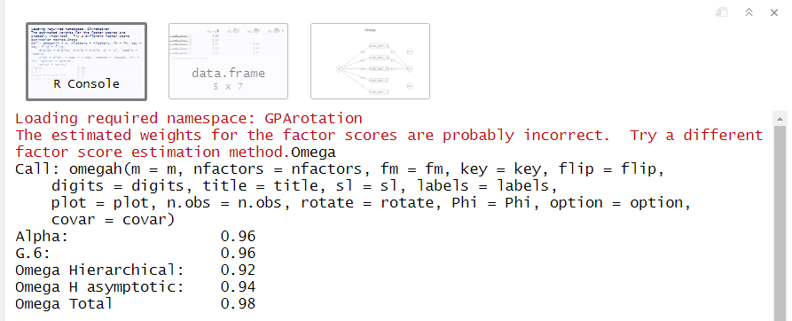

```{r child = "setup.Rmd"}
```
```{r packages, include = F, eval = T}
library(tidyverse) ## because tidyverse = life
library(skimr) ## looking at the data
library(summarytools) ## looking at the data
library(broom) ## for extracting output using broom
library(janitor) ## for chi-square: tabyl for chi-squares
library(correlation) ## for correlation: tidy correlation results
library(lm.beta) ## for regression: standardized coefficients
library(psych) ## for reliability: omega and alpha
library(apa) ## for reporting results in APA format

college <- read_csv("../Data/college.csv")
```


class: center, middle, dk-section-title

# Welcome to the Course!

---


## What you will learn in this course

???

This course will cover seven topics. 
1. First, we're going to learn four main inferential statistics...

5. We'll also learn how to conduct reliability such as Cronbach's alpha, a measure of internal consistency.

6. Then we'll learn how to report statistics in R through learning how to extract values from the summary output, tidying up the results, and using packages to report statistics easily.

7. Lastly, we'll cover how to test assumptions of your parametric tests and what to do if you do not meet the assumptions of normally distributed data. 

--

1. t-tests: independent and dependent

--

2. ANOVA: mainly the one-way ANOVA

--

3. chi-square

--

4. regression

--

5. reliability (internal consistency)

--

6. how to report statistics in R

--

7. how to test parametric assumptions

---

## What you will need for this course

-- 

1. R and RStudio!

--

2. Dataset: college.csv

--

3. Packages: [insert packages here]
  + broom
  + apa
  + psych
  + lm.beta
  + etc.

---

## How this course will work

---

class: center, middle, dk-section-title

# Introduction to the dataset

---

## college.csv

```{r eval = TRUE}
college <- read_csv("../Data/college.csv")

college 
```

---

```{r eval = TRUE, echo = FALSE, results = 'asis'}
st_css()
print(dfSummary(college[2:5], style = "grid", valid.col = FALSE, caption = FALSE, graph.magnif = 1.2,
                varnumbers = FALSE, na.col = FALSE, headings = FALSE), method = 'render')
```

---

```{r eval = TRUE, echo = FALSE, results = 'asis'}
st_css()
print(dfSummary(college[6:9], style = "grid", valid.col = FALSE, caption = FALSE, graph.magnif = 1.2,
                varnumbers = FALSE, na.col = FALSE, headings = FALSE), method = 'render')
```

---

```{r eval = TRUE, echo = FALSE, results = 'asis'}
st_css()
print(dfSummary(college[c(10:11, 14)], style = "grid", valid.col = FALSE, caption = FALSE,
                varnumbers = FALSE, na.col = FALSE, headings = FALSE), method = 'render')
```

---

```{r eval = TRUE, echo = FALSE, results = 'asis'}
st_css()
print(dfSummary(college[15:18], style = "grid", valid.col = FALSE, caption = FALSE,
                varnumbers = FALSE, na.col = FALSE, headings = FALSE), method = 'render')
```

---

## Satisfaction with Life Scale

```{r eval = TRUE, echo = FALSE, results = 'asis', rows.print = 10}
college %>%
  select(19:28) %>%
  summarytools::descr(., stats = c("mean", "min", "max"), headings = FALSE) %>%
  tb()
```

---

```{r eval = TRUE, echo = FALSE, results = 'asis'}
st_css()
print(dfSummary(college[29:31], style = "grid", valid.col = FALSE, caption = FALSE,
                varnumbers = FALSE, na.col = FALSE, headings = FALSE), method = 'render')
```

---

class:inverse

## Your Turn

You'll be working with the college dataset to run all your analyses. 

--

1. Create a new project. Make sure you put it somehwere you'll be able to find it again later!

--

1. Download the dataset "college.csv"

--

1. Create a new R script file where you'll do all of your inferential statistics

--

1. Import the spreadsheet into a dataframe `college`

---

class: center, middle, dk-section-title

# Independent t-test

---

## Independent vs dependent t-test

.pull-left[
### Independent t-test

- Between-subjects
- Independent samples
- Examine the mean difference between two unrelated groups (e.g., males and females, a group of mothers and a group of daughters)
]

--

.pull-right[
### Dependent t-test

- Within-subjects
- Dependent or paired samples
- Examine the mean difference between two related groups (e.g., same group at two time points, pairs of mothers and daughters)
]

--

Both t-tests are performed using the `t.test()` function in the **stats** package

---

## Independent t-test in R

```{r}
dat %>%
  t.test(DV ~ IV, .)
```

???

This is the basic syntax of the independent t-test using the tidyverse. There are a lot of other arguments in the t.test function that we'll slowly learn about. 

---

## Independent t-test in R

```{r}
dat %>%
  t.test(DV ~ IV, `.`)
```

???

One of the arguments is the data argument. In the t.test function, the dataset argument comes second. This is why the dot comes second instead of first.

--

```{r}
dat %>%
  t.test(., DV ~ IV)
```

--

`## Error: Can't combine id <character> and athlete <double>.`

???

If you put the dot first, indicating to put the dataset at the beginning, it won't work

---

## An example

Let's try running an independent samples t-test with our `college` dataset. 

--

```{r}
college %>%
  t.test(weight_2 ~ smokes, .)
```

--

```{r eval = TRUE, echo = FALSE}
college %>%
  t.test(weight_2 ~ smokes, .)
```

--

The t-test defaults to assuming the variances between groups is *not* equal.

---

## Variances Equal

```{r}
college %>%
  t.test(weight_2 ~ smokes, ., `var.equal = TRUE`)
```

???

Add the argument `var.equal = TRUE` to specify that we assume the variances between groups is equal.

--

```{r eval = TRUE, echo = FALSE}
college %>%
  t.test(weight_2 ~ smokes, ., var.equal = TRUE)
```

---

## Alternative hypothesis

The default alternative hypothesis is a **two-sided hypothesis** that the mean difference is not equal to 0. 

```{r}
college %>%
  t.test(weight_2 ~ smokes, ., var.equal = TRUE, `alternative = "two.sided"`)
```

--

What if you have a **one-sided hypothesis**? 

--

```{r}
college %>%
  t.test(weight_2 ~ smokes, ., var.equal = TRUE, `alternative = "greater"`)
```

```{r}
college %>%
  t.test(weight_2 ~ smokes, ., var.equal = TRUE, `alternative = "less"`)
```

???

The alternative argument lets you specify either **less** or **greater** than 0. 

---

## Alternative hypothesis

.pull-left[
```{r, eval = TRUE}
college %>%
  t.test(weight_2 ~ smokes, ., 
         var.equal = TRUE, 
         alternative = "two.sided")
```
]

--

.pull-right[
```{r, eval = TRUE}
college %>%
  t.test(weight_2 ~ smokes, ., 
         var.equal = TRUE, 
         alternative = "greater")
```
]

???

Notice that the p-value is half of the previous value of .2305. 

---

## Other arguments in the t-test
.pull-left[
```{r}
college %>%
  t.test(weight_2 ~ smokes, ., 
         `mu = 1`)
```
```{r eval = TRUE, echo = FALSE}
college %>%
  t.test(weight_2 ~ smokes, ., 
         mu = 1)
```
]

???

mu is a greek symbol for the population mean, or in this case the mean difference that we're testing for. It defaults at 0, but you can change it to any value to test whether the mean difference is mu.

--

.pull-right[
```{r}
college %>%
  t.test(weight_2 ~ smokes, ., 
         `conf.level = .99`)
```
```{r eval = TRUE, echo = FALSE}
college %>%
  t.test(weight_2 ~ smokes, ., 
         conf.level = .99)
```
]

???

You can also adjust the confidence intervals to be from the default 95% confidence interval to something else, such as a 99% confidence interval.

---

class: inverse

## Your Turn

--

1. Open the R project for this course and your R markdown file. Run the beginning of your script so you have the `college` dataset available in your R environment.

--

1. Perform an independent samples t-test to test whether there is a difference in `exam_1` by `athlete`. Use `var.equal = TRUE`. Is there a difference? What is the p-value? 

--

1. Filter your dataset to only people who have the `gender` of Male or Female (alternative, filter out those who are Trans*). Perform an independent samples t-test to test whether there is a difference in `act_english` by `gender` party. Use `var.equal = TRUE`. Is there a difference? What is the p-value? 

```{r, include = FALSE}

### T-TEST ANSWERS

## 2 ##
college %>%
  t.test(exam_1 ~ athlete, ., var.equal = TRUE)

## 3 ##
college %>%
  filter(gender != "Trans*") %>%
  t.test(act_english ~ gender, ., var.equal = FALSE)
```

---

class: center, middle, dk-section-title

# Dependent t-test

---

## Independent vs dependent t-test

.pull-left[
### Independent t-test

- Between-subjects
- Independent samples
- Examine the mean difference between two unrelated groups (e.g., males and females, a group of mothers and a group of daughters)
]

.pull-right[
### Dependent t-test

- Within-subjects
- Dependent or paired samples
- Examine the mean difference between two related groups (e.g., same group at two time points, pairs of mothers and daughters)
]

---

## Dependent t-test in R

The dependent t-test adds a new argument to the `t.test` function: 

.center[`paired = TRUE`]

--

.pull-left[
```{r}
t.test(`dat$DV1, dat$DV2`, 
       paired = TRUE)
```


Used when the data are in **wide** format.

Each *case or pair* is a row, and the DV is in two different columns.
(This is most common.)

<font size = "3">Note that piping the dataset doesn't work here. You have to explicitly type out data$DV.</font>
]

--

.pull-right[
```{r}
dat %>%
  t.test(`DV ~ IV`, paired = TRUE, .)
```
Used when the data are in **long** format.

Each *observation* is a row, and the DV is in one column and the case or pair ID is in another column.
]

???

This is the basic syntax of the dependent t-test using the tidyverse. Notice the inclusion of paired = TRUE argument. This tells R the data is a paired samples or dependent samples t-test. 

There are two ways of inputting the data. If your data is in wide format, with each person representing a row and two columns of data per person, then you'll use the first set of code. However, if your data is in long format, with each person's data at two time points representing a row (therefore having double the rows of data) then you'll use the second set of code. 

---

## An example

```{r}
t.test(college$weight_1, college$weight_2, paired = TRUE)
```

--

```{r, eval = TRUE, echo = FALSE, highlight.output = 5}
t.test(college$weight_1, college$weight_2, paired = TRUE)
```

---

## Converting wide to long format

```{r}
college %>%
  select(weight_1, weight_2) %>%
  pivot_longer(cols = starts_with("weight"), 
               names_to = "time",
               values_to = "weight",
               names_prefix = "weight_") %>%
  `t.test(weight ~ time, data = ., paired = TRUE)`
```

--

```{r, eval = TRUE, echo = FALSE, highlight.output = 5}
college %>%
  select(weight_1, weight_2) %>%
  pivot_longer(cols = starts_with("weight"), 
               names_to = "time",
               values_to = "weight",
               names_prefix = "weight_") %>%
  t.test(weight ~ time, data = ., paired = TRUE)
```

---

class: inverse

## Your Turn

--

1. Open the R project for this course and your R markdown file. Run the beginning of your script so you have the `college` dataset available in your R environment.

--

1. Perform a  dependent samples t-test to test whether there is a difference in exam scores: `exam_1` and `exam_2`. Is there a difference? What is the p-value? 

--

1. Perform a dependent samples t-test to test whether there is a difference in `act_science` and `act_mathematics` scores. Is there a difference? What is the p-value?

--

**Bonus!!!**

Using `pivot_longer` pivot your data so it is in long form. Perform a dependent samples t-test to test whether there is a difference in `act_science` and `act_english` scores using the long-data t.test code.

```{r, include = FALSE}

### T-TEST ANSWERS

## 2 ##
t.test(college$exam_1, college$exam_2, paired = TRUE)

## 3 ##
t.test(college$act_science, college$act_mathematics, paired = TRUE)

## BONUS ##
college %>%
  select(act_science, act_english) %>%
  pivot_longer(cols = starts_with("act"), 
               names_to = "act",
               values_to = "score",
               names_prefix = "act_") %>%
  t.test(score ~ act, data = ., paired = TRUE)

```


---

class: center, middle, dk-section-title

# One-way ANOVA

---

## One-way ANOVA

- Between-subjects

--

- Independent samples

--

- Examine the mean difference between **three or more** unrelated groups

--

- Tests the null hypothesis that the three or more means are the same

--

- To know *where* the mean differences are, we need planned contrasts or post-hoc procedures like Tukey's HSD (we'll cover that in the next video)

---

## One-way ANOVA in R

```{r}
dat %>%
  `aov`(DV ~ IV, data = .) %>%
  summary()
```

The formatting for the one-way ANOVA is similar to that of `t.test` except we replace it with `aov`.

---

## An example

```{r, eval = TRUE}
college %>%
  aov(exam_1 ~ grade_class, data = .)
```

--

The output is not very useful. For that reason, we need to ask for the summary of the model. 

---

## An example

```{r}
college %>%
  aov(age ~ grade_class, data = .) %>%
  summary() #<<
```

--

```{r, eval = TRUE, echo = FALSE}
college %>%
  aov(age ~ grade_class, data = .) %>%
  summary()
```

```{r, eval = TRUE, echo = FALSE}
modelsummary <- summary(aov(age ~ grade_class, data = college))
```

The `summary()` output provides the F-value (`r round(modelsummary[[1]]$"F value"[1], 2)`), df (`r modelsummary[[1]]$Df`), and p-value (`r round(modelsummary[[1]]$"Pr(>F)"[1], 3)`) you need to report the statistical values. 

The summary will add asterisks if there are any statistically significant p-values (e.g., `‘*’ 0.05`).

---

class: inverse

## Your Turn

--

1. Open the R project for this course and your R markdown file. Run the beginning of your script so you have the `college` dataset available in your R environment.

--

1. Perform a one-way ANOVA to test whether there is a difference in `hs_gpa` by `grade_class`. Is there a difference? What is the p-value? 

--

1. Perform a one-way ANOVA to test whether there is a difference in `act_english` by `race`. Is there a difference? What is the p-value? 

```{r include = FALSE}

### ONE-WAY ANOVA ANSWERS

## 2 ##
college %>%
  aov(hs_gpa ~ grade_class, data = .) %>%
  summary()

## 3 ##
college %>%
  aov(act_english ~ race, data = .) %>%
  summary()
```

---

class: center, middle, dk-section-title

# Post hoc comparisons

---

## Post hoc comparisons

The one-way ANOVA tests the null hypothesis that there is no mean difference between the 3+ groups. If the one-way ANOVA is statistically significant, it does not tell us *where* the differences lie.

--

For that, we need post hoc comparisons.*

--

There are many post hoc comparisons possible (e.g., Fisher's LSD, Bonferroni, Newman-Keuls, Scheffe), but we're going to focus on **Tukey's HSD** because it's easy to calculate and does a good job protecting against Type I errors without being too conservative. 

??

Tukey's Honest Significant Differences

---

## Tukey's HSD

```{r}
dat %>%
  aov(DV ~ IV, data = .) %>%
  `TukeyHSD()`
```

---

## An example

```{r}
college %>%
  aov(act_reading ~ gender, data = .) %>%
  summary()
```

--

```{r, eval = TRUE, echo = FALSE}
college %>%
  aov(act_reading ~ gender, data = .) %>%
  summary()
```

---

## An example

```{r}
college %>%
  aov(act_reading ~ gender, data = .) %>%
  TukeyHSD()
```

--

```{r, eval = TRUE, echo = FALSE, highlight.output = 8}
college %>%
  aov(act_reading ~ gender, data = .) %>%
  TukeyHSD()
```

--

Female students tend to have higher ACT reading scores than male students. There are no differences in ACT reading scores between male and female students with Trans* students.

---

class: inverse

## Your Turn

--

1. Open the R project for this course and your R markdown file. Run the beginning of your script so you have the `college` dataset available in your R environment.

--

1. Perform one-way ANOVA to test whether there is a difference in `hs_gpa` by `grade_class`. Is there a difference? If so, perform a Tukey's HSD to test where the differences are. Describe the differences.

--

1. Perform one-way ANOVA to test whether there is a difference in `weight_1` by `gender`. Is there a difference? If so, perform a Tukey's HSD to test where the differences are. Describe the differences. 

```{r include = FALSE}

### ONE-WAY ANOVA ANSWERS

## 2 ##
college %>%
  aov(hs_gpa ~ grade_class, data = .) %>%
  summary()
# No Tukey's HSD because there is no statistically significant difference.

## 3 ##
college %>%
  aov(weight_1 ~ gender, data = .) %>%
  summary()

college %>%
  aov(weight_1 ~ gender, data = .) %>%
  TukeyHSD
# 
```

---

class: center, middle, dk-section-title

# Other ANOVA tests

---

## Repeated measures ANOVA

Repeated Measures ANOVA allows us to examine designs in which the same people or samples contributed to the different means (within-groups design). This means that all participants or cases participated in all conditions of an experiment or IV. 

**Example**: Let's examine how exam scores (`exam_1`, `exam_2`, and `exam_3`) differ within individuals across time. 

---

### An example

First, we need to convert our data to long format.

```{r}
college %>%
  select(starts_with("exam"), id) %>%
  pivot_longer(cols = starts_with("exam"), 
               names_to = "exam",
               values_to = "score",
               names_prefix = "exam_")
```

--

```{r, eval = TRUE, echo = FALSE}
college %>%
  select(starts_with("exam"), id) %>%
  pivot_longer(cols = starts_with("exam"), 
               names_to = "exam",
               values_to = "score",
               names_prefix = "exam_")
```

---

### An example

Then we can run our repeated measures ANOVA.

```{r}
college %>%
  select(starts_with("exam"), id) %>%
  pivot_longer(cols = starts_with("exam"), 
               names_to = "exam",
               values_to = "score",
               names_prefix = "exam_") %>%
  aov(score ~ exam + Error(id), data = .) %>% #<<
  summary() #<<
```

--

```{r, eval = TRUE, echo = FALSE, highlight.output = 8}
college %>%
  select(starts_with("exam"), id) %>%
  pivot_longer(cols = starts_with("exam"), 
               names_to = "exam",
               values_to = "score",
               names_prefix = "exam_") %>%
  aov(score ~ exam + Error(id), data = .) %>%
  summary()
```

---

## Factorial ANOVA

Factorial ANOVA allows us to examine two or more independent variables (IVs) simultaneously. There are several types of factorial designs:

--

- **Independent factorial design**: 2+ between-group (independent) IVs 

--

-	**Repeated measures factorial design**: 2+ within-group (repeated-measures) IVs

--

-	**Mixed factorial design**: 1+ between-group and 1+ within-group IVs

---

## Factorial ANOVA

To perform a factorial ANOVA in R, all you need to do is add more variables to the right hand of the tilde (~) in the ANOVA equation using either a + (does not add an interaction term) or * (adds an interaction term).

---

## Example independent factorial design

```{r, eval = TRUE}
college %>% aov(weight_1 ~ gender + smokes, data = .) %>% summary() # NO INTERACTION
```

--

```{r, eval = TRUE}
college %>% aov(weight_1 ~ gender * smokes, data = .) %>% summary() #  INTERACTION 
```

---

class: inverse

## Your Turn

--

Read more about how to conduct repeated measures and factorial ANOVA designs using the resources below.


---

class: center, middle, dk-section-title

# Chi-square

---

## Chi-square

The chi-square test is used to analyze categorical data (data that describe categories of entities). We can't examine categorical data using things like means or medians, so we examine counts instead. 

--

```{r}
college %>% 
  tabyl(live_on_campus, athlete)
```

--

```{r, eval = TRUE, echo = FALSE}
college %>% 
  tabyl(live_on_campus, athlete)
```


---

## Chi-square in R

Two methods: the `janitor` package or the `stats` package

--

.pull-left[
###Janitor Package
```{r, eval = TRUE, highlight.output = 5}
college %>%
  tabyl(smokes, athlete) %>%
  janitor::chisq.test()
```

]

--

.pull-right[
###stats Package
```{r, eval = TRUE, highlight.output = 5}
stats::chisq.test(college$smokes, college$athlete)
```
]

---

## Standardized Residuals

The standardized residuals tell us for that cell if the expected and observed frequency are independent. They are z-scores so values greater than 1.96 are statistically significant (*p* < .05).

--

```{r}
tab$stdres #<<
```

--

```{r, eval = TRUE, echo = FALSE}
tab <- college %>%
  tabyl(smokes, athlete) %>%
  janitor::chisq.test(.)

tab$stdres
```

---

## Observed and expected counts

Similarly, we can ask for the observed and expected counts.

--

.pull-left[
### Observed
```{r, eval = TRUE}
tab$observed
```
]

--

.pull-left[
### Expected
```{r, eval = TRUE}
tab$expected
```
]

---

class: inverse

## Your Turn

--

1. Open the R project for this course and your R markdown file. Run the beginning of your script so you have the `college` dataset available in your R environment.

--

1. Perform a chi-square to examine how `grade_class` relates to `live_on_campus`. What is the p-value? Is there a relationship?

--

1. If there is a significant difference, examine standardized residuals and the observed/expected frequencies to determine what grade class is more or less likely to live on campus. Interpret the results.

```{r include = FALSE}

### CHI-SQUARE ANSWERS

## 2 ##
tab2 <- college %>%
  tabyl(grade_class, live_on_campus) %>%
  chisq.test()

tab2

## 3 ##
tab2$stdres

tab2$observed

tab2$expected
# 
```

---

class: center, middle, dk-section-title

# Dealing with small cells

---

## Dealing with small cells

Sometimes when dealing with small cells, you will get an error that the Chi-square approximation may not be correct. 

--

Example:

```{r, eval = TRUE, warning = TRUE}
college %>%
  filter(smokes == 1) %>%
  tabyl(race, gender) %>%
  chisq.test()
```

--

There are a few things we can do to fix this problem.

---

## 1. Drop a row or column

--

```{r, eval = TRUE}
college %>%
  filter(smokes == 1) %>%
  tabyl(race, gender)
```

---

## 1. Drop a row or column

```{r, eval = TRUE, warning = TRUE}
college %>%
  filter(smokes == 1) %>%
  filter(gender != "Trans*") %>% #<<
  tabyl(race, gender)
```

---

## 1. Drop a row or column

```{r, eval = TRUE, warning = TRUE}
college %>%
  filter(smokes == 1) %>%
  filter(gender != "Trans*") %>%
  tabyl(race, gender) %>%
  chisq.test()  #<<
```

---

## 2. Combine rows or columns so there are larger cells

--

```{r, eval = TRUE}
college %>%
  filter(smokes == 1) %>%
  tabyl(race, gender)
```

---

## 2. Combine rows or columns so there are larger cells

```{r, eval = TRUE}
college %>%
  filter(smokes == 1) %>%
  mutate(URM = recode(race, "Bi-Racial" = 1,  #<<
                      "Asian" = 0, "White" = 0,  #<<
                      "Black" = 1, "Hispanic" = 1)) %>%  #<<
  tabyl(URM, gender)
```

---

## 2. Combine rows or columns so there are larger cells

```{r, eval = TRUE}
college %>%
  filter(smokes == 1) %>%
  mutate(URM = recode(race, "Bi-Racial" = 1,
                      "Asian" = 0, "White" = 0,
                      "Black" = 1, "Hispanic" = 1)) %>%
  tabyl(URM, gender) %>%
  chisq.test()  #<<
```

---

## 3. Both!

--

```{r, eval = TRUE}
college %>%
  filter(smokes == 1) %>%
  filter(gender != "Trans*") %>%  #<< 
  mutate(URM = recode(race, "Bi-Racial" = 1,  #<<
                      "Asian" = 0, "White" = 0,  #<<
                      "Black" = 1, "Hispanic" = 1)) %>%  #<<
  tabyl(URM, gender)
```

---

## 3. Both!

```{r, eval = TRUE}
college %>%
  filter(smokes == 1) %>%
  filter(gender != "Trans*") %>%
  mutate(URM = recode(race, "Bi-Racial" = 1,
                      "Asian" = 0, "White" = 0,
                      "Black" = 1, "Hispanic" = 1)) %>%
  tabyl(URM, gender) %>%
  chisq.test()  #<<
```

---

class: center, middle, dk-section-title

# Correlation

---

## Correlation

Tests the relationship between two (usually) continuous variables.

--

There are three methods you can use to test correlations.

--

1. **`cor()` and `cor.test()` in the `stats` package**. `cor()` can do a correlation matrix, but no p-values. `cor.test()` can provide p-values, but can't do so with a correlation matrix.

--

2. **`rcorr()` in the `Hmisc` package**. `rcorr()` can provide a correlation matrix with p-values, but not in a tidy format.

--

3. **`correlation()` in the `correlation` package**. `correlation()` can provide a correlation matrix with p-values, but it can also do so in a tidy format.

---

## Correlation in R

--

```{r}
college %>%
  select(exam_1, exam_2) %>%
  correlation() #<<
```

--

```{r, eval = TRUE, echo = FALSE}
college %>%
  select(exam_1, exam_2) %>%
  correlation()
```

---

## Correlation in R

--

```{r}
college %>%
  select(exam_1, exam_2) %>%
  correlation() %>%
  select(r, p) #<<
```

--

```{r, eval = TRUE, echo = FALSE}
college %>%
  select(exam_1, exam_2) %>%
  correlation() %>%
  select(r, p)
```

---

## Correlation Matrix in R

```{r}
college %>%
  select(starts_with("exam")) %>% #<<
  correlation()
```
--

```{r, eval = TRUE, echo = FALSE}
college %>%
  select(starts_with("exam")) %>%
  correlation()
```

---

## Correlation Matrix in R

```{r}
college %>%
  select(starts_with("exam")) %>%
  correlation() %>%
  summary() #<<
```
--

```{r, eval = TRUE, echo = FALSE}
college %>%
  select(starts_with("exam")) %>%
  correlation() %>%
  summary()
```

---

class: inverse

## Your Turn

--

1. Open the R project for this course and your R markdown file. Run the beginning of your script so you have the `college` dataset available in your R environment.

--

1. Perform a correlation among the four ACT scores. Which two scales of the ACT have the highest correlation? Which two scales have the lowest correlation?

```{r include = FALSE}

### CORRELATION ANSWERS

## 2 ##
college %>%
  select(starts_with("act")) %>%
  correlation() %>%
  summary()

# Highest: act_english & act_mathematics r = .83***
# Lowest: act_english & act_reading r = .38***

```

---

class: center, middle, dk-section-title

# Regression

---

## Three basic types of regression

1. **Linear regression** has a single IV

--

2. **Multiple regression** has multiple IVs

--

3. **Hierarchical regression** has multiple IVs across multiple "steps"

--

All three use the `lm()` function in the `stats` package.

---

## Linear regression
.left-code[
```{r}
college %>%
  lm(exam_1 ~ iq, #<<
     data = .) #<<
```
]

--

.right-plot[
```{r eval = TRUE, echo = FALSE}
college %>%
  lm(exam_1 ~ iq, data = .)
```
]

---

## Linear regression

.left-code[
```{r}
college %>%
  lm(exam_1 ~ iq, 
     data = .) %>%
  summary() #<<
```
]

--

.right-plot[
```{r eval = TRUE, echo = FALSE, highlight.output = c(12, 17)}
college %>%
  lm(exam_1 ~ iq, data = .) %>%
  summary()
```
]

---

## Standardized Coefficients

.left-code[
```{r}
college %>%
  lm(exam_1 ~ iq, 
     data = .) %>%
  lm.beta() %>% #<<
  summary() 
```
]

--

.right-plot[
```{r eval = TRUE, echo = FALSE, highlight.output = 12}
college %>%
  lm(exam_1 ~ iq, 
     data = .) %>%
  lm.beta() %>% 
  summary()
```
]

---

class: inverse

## Your Turn

--

1. Open the R project for this course and your R markdown file. Run the beginning of your script so you have the `college` dataset available in your R environment.

--

1. Perform a linear regression examining how `iq` predicts `act_reading`. Ask for standardized coefficients before calling for the summary of results. Is IQ a significant predictor of ACT reading scores? If so, what is the standardized coefficient?

```{r include = FALSE}

### LINEAR REGRESSION ANSWERS

## 2 ##
college %>%
  lm(act_reading ~ iq, 
     data = .) %>%
  lm.beta() %>% 
  summary()

# Yes, it's significant (p = .024). Beta = -.13

```

---

class: center, middle, dk-section-title

# Multiple Regression

---

## Multiple Regression in R

To perform a multiple regression, add the IVs to the right of the ~ (tilde).

--

**Example**: DV ~ IV1 + IV2

--

<br />

With both `aov()` and `lm()`, you can request interactions by replacing the + with a *.

--

**Example**: DV ~ IV1 * IV2

---

```{r}
college %>%
  lm(exam_2 ~ iq` + `exam_1, data = .) %>%
  lm.beta() %>% 
  summary()
```

--

```{r eval = TRUE, echo = FALSE, highlight.output = c(12, 13, 18)}
college %>%
  lm(exam_2 ~ iq + exam_1, 
     data = .) %>%
  lm.beta() %>% 
  summary()
```

---

```{r}
college %>%
  lm(exam_2 ~ iq` * `exam_1, data = .) %>%
  lm.beta() %>% 
  summary()
```

--

```{r eval = TRUE, echo = FALSE, highlight.output = c(12:14, 19)}
college %>%
  lm(exam_2 ~ iq * exam_1, 
     data = .) %>%
  lm.beta() %>% 
  summary()
```

---

## Categorical predictors

```{r}
college %>%
  lm(exam_2 ~ iq + `gender`, data = .) %>%
  lm.beta() %>% 
  summary()
```

--

```{r eval = TRUE, echo = FALSE, highlight.output = c(12:14, 19)}
college %>%
  lm(exam_2 ~ iq + gender, 
     data = .) %>%
  lm.beta() %>% 
  summary()
```

---

class: inverse

## Your Turn

--

1. Open the R project for this course and your R markdown file. Run the beginning of your script so you have the `college` dataset available in your R environment.

--

1. Perform a multiple regression examining how both `iq` and `act_science` predict `act_reading`. Ask for standardized coefficients before calling for the summary of results. Which (if any) of the IVs are significant predictors? Based on the standardized coefficient, which is the stronger predictor of ACT readings cores?

```{r include = FALSE}

### MULTIPLE REGRESSION ANSWERS

## 2 ##
college %>%
  lm(act_reading ~ iq + act_science, 
     data = .) %>%
  lm.beta() %>% 
  summary()

# Both are significant. Science scores is a stronger predictor of reading scores than IQ.

```

---

class: center, middle, dk-section-title

# Hierarchical Regression

---

## Hierarchical Regression

Hierarchical regression takes a *little* more work than in SPSS. Here are the steps:

--

1. Perform a regression with your first set of predictors.

--

2. Perform a regression *adding* your second set of predictors.

--

3. Run `anova()` comparing the two models. 

---

## Hierarchical Regression in R

.pull-left[
**Step 1:** 

```{r eval = TRUE}
lm1 <- #<<
  college %>%
  lm(exam_2 ~ iq, data = .) %>% #<<
  lm.beta()
```
]

--

.pull-right[
**Step 2:** 

```{r eval = TRUE}
lm2 <- #<<
  college %>%
  lm(exam_2 ~ iq + exam_1, data = .) %>% #<<
  lm.beta()
```
]

--

**Step 3:**
```{r eval = TRUE}
anova(lm1, lm2) #<<
```

---

class: inverse

## Your Turn

--

Read more about hierarchical regression with the resources below.

---

class: center, middle, dk-section-title

# Reliability

---

## Reliability

When working with scales, we want to see how well items "hang together." This is called internal consistency, which is a type of reliability. 

--

You are likely familiar with Cronbach's alpha as a measure of internal consistency. 

--

However, Cronbach's alpha has assumptions your data *may not* meet. For that reason, I recommend using omega instead. 

---

## Assumptions of Cronbach's alpha

--

1. Scale is unidimensional

--

2. Scale items are continuous and normally distributed

--

3. Tau equivalence

--

4. Errors of the items do not covary

---

## Tau equivalence

.pull-left[
### Tau Equivalent
| Item          | Std. Loading  |
| ------------- |:-------------:|
| Q1            | .711          |
| Q2            | .714          |
| Q3            | .716          |
| Q4            | .709          |
| Q5            | .721          |
]

.pull-right[
### Not Tau Equivalent
| Item          | Std. Loading  |
| ------------- |:-------------:|
| Q1            | .806          |
| Q2            | .790          |
| Q3            | .725          |
| Q4            | .578          |
| Q5            | .523          |
]

--

In my experience running lots of factor analyses, I *almost never* have tau equivalence.

---

## Covarying item errors

Some items may be more related to other items in the
scale for a variety of reasons:

--

- The items are very similarly worded

--

- The items measure essentially the same thing

--

- Order of items

--

- Speeded tests

--

- Transient responses where feelings or opinions may change
over the course of the scale

--

- Unmodeled multidimensionality of the scale

---

## Omega

Omega is designed for scales that are not tau equivalent (also called congeneric). Most of our scales are congeneric!

*Therefore, I recommend you always use omega instead of alpha!*

The values are interpreted just the same as you would alpha. It will just be a less biased estimate of the internal consistency of your scale, especially if you do not meet the assumptions of alpha.

---

## Omega and alpha in R

```{r}
library(psych)

omega(dat)

alpha(dat)
```

---

## An example: omega

```{r}
college %>%
  select(starts_with("swls_time1")) %>%
  omega()
```

--



---

## An example: omega

```{r}
college %>%
  select(starts_with("swls_time1")) %>%
  omega()
```


---

## An example: omega

```{r}
college %>%
  select(starts_with("swls_time1")) %>%
  omega()
```


---

## An example: omega

```{r}
college %>%
  select(starts_with("swls_time1")) %>%
  omega()
```


---

## An example: alpha

```{r}
college %>%
  select(starts_with("swls_time1")) %>%
  alpha()
```


???

1. Shows us the call, the Cronbach's alpha with 95% CI. Reliability if an item is dropped is blank because our reliability is good with this scale. Then it'll provide some item statistics, including the frequency of response at each level of the scale and missing data information, but we're not missing any data. I'll show that next.

---

## An example: alpha

```{r}
college %>%
  select(starts_with("swls_time1")) %>%
  alpha()
```

```{r eval = TRUE, echo = FALSE}
temp <- college %>%
  select(starts_with("swls_time1")) %>%
  psych::alpha()

temp[["response.freq"]]
```

---

## An example: alpha

```{r}
college %>%
  select(starts_with("swls_time1")) %>%
  alpha()
```

```{r eval = TRUE, echo = FALSE}
temp$total
```

???
2. The second data frame is the total alpha, and provides the raw and standardized alpha values, along with a lot of other information you probably don't need.

---

## An example: alpha

```{r}
college %>%
  select(starts_with("swls_time1")) %>%
  alpha()
```

```{r eval = TRUE, echo = FALSE}
temp$alpha.drop
```

???

3. The third table is really helpful and provides the alpha value if an item is dropped. This is useful in case you have a value that needs to be recoded or dropped. 

---

## An example: alpha

```{r}
college %>%
  select(starts_with("swls_time1")) %>%
  alpha()
```

```{r eval = TRUE, echo = FALSE}
temp$item.stats
```

???

4. The last table provides the item statistics, including the item-total correlations which are often used to determine the discrimination values of items.

---

class: inverse

## Your Turn

--

1. Open the R project for this course and your R markdown file. Run the beginning of your script so you have the `college` dataset available in your R environment.

--

1. Perform a test of internal consistency using both omega and alpha on the SWLS scale at time 2. Does the scale have good internal consistency at time 2, as well?

--

1. (Optional) Read the article by McNeish (2018) explaining why omega is often a better measure of internal consistency than alpha. 

```{r include = FALSE}

### RELIABILITY ANSWERS

## 2 ##
college %>%
  select(starts_with("swls_time2")) %>%
  omega()

college %>%
  select(starts_with("swls_time2")) %>%
  alpha()

# Yes, it has good internal consistency. 
# Should use omega, which is .98. Alpha is .95

```

---

class: center, middle, dk-section-title

# Extracting Output

---

## Extracting Output

.center[
So you've got your output...
]
--

.center[
**what next?**
]

---

## An example: alpha

```{r}
college %>%
  select(starts_with("swls_time1")) %>%
  alpha()
```


---

## An example: alpha

.pull-left[
```{r}
rel <- #<<
  college %>%
  select(starts_with("swls_time1")) %>%
  alpha()
```

```{r eval = TRUE, echo = FALSE, include = FALSE}
rel <- college %>%
  select(starts_with("swls_time1")) %>%
  psych::alpha()
```
]

--

.pull-right[

]

---

## An example: alpha

```{r}
rel$alpha.drop #<<
```

--

```{r eval = TRUE, echo = FALSE}
rel$alpha.drop
```

---

## An example: alpha

```{r}
rel$alpha.drop %>%
  select(std.alpha) %>% #<<
  rownames_to_column("var") %>% #<<
  arrange(std.alpha) #<<
```
```{r eval = TRUE, echo = FALSE}
rel$alpha.drop %>%
  select(std.alpha) %>%
  rownames_to_column("var") %>%
  arrange(std.alpha)
```

---

## An example: alpha

.pull-left[
```{r}
drop <- #<<
  rel$alpha.drop %>%
  select(std.alpha) %>%
  rownames_to_column("var") %>%
  arrange(std.alpha)
```
]

---

## An example: alpha

.pull-left[
```{r}
drop <-
  rel$alpha.drop %>%
  select(std.alpha) %>%
  rownames_to_column("var") %>%
  arrange(std.alpha)

rel$total %>% #<<
  select(std.alpha) %>% #<<
  rownames_to_column("var") %>% #<<
  bind_rows(drop) %>% #<<
  mutate(std.alpha = round(std.alpha, 3)) #<<
```
]

--

.pull-right[
```{r eval = TRUE, echo = FALSE, rows.print = 10}
drop <-
  rel$alpha.drop %>%
  select(std.alpha) %>%
  rownames_to_column("var") %>%
  arrange(std.alpha)

rel$total %>% 
  select(std.alpha) %>% 
  rownames_to_column("var") %>% 
  bind_rows(drop) %>%
  mutate(std.alpha = round(std.alpha, 3))
```
]

---

class: inverse

## Your Turn

--

1. Open the R project for this course and your R markdown file. Run the beginning of your script so you have the `college` dataset available in your R environment.

--

1. Perform a test of internal consistency using omega on the SWLS scale at time 2. Extract the `omega.tot` information from the list. Round it to two decimals. What is your omega value?

```{r include = FALSE}

### EXTRACTING BASE R ANSWERS

## 2 ##
relomega <- college %>%
  select(starts_with("swls_time2")) %>%
  omega()

relomega$omega.tot %>%
  round(2)

  ## .98

```

---

class: center, middle, dk-section-title

# Broom Package

---

## Independent t-test

```{r}
college %>%
  t.test(weight_2 ~ smokes, ., var.equal = TRUE)
```

--

```{r eval = TRUE, echo = FALSE}
college %>%
  t.test(weight_2 ~ smokes, ., var.equal = TRUE)
```

---

## Independent t-test with broom

```{r}
college %>%
  t.test(weight_2 ~ smokes, ., var.equal = TRUE) %>%
  tidy() #<<
```
--

```{r eval = TRUE, echo = FALSE}
college %>%
  t.test(weight_2 ~ smokes, ., var.equal = TRUE) %>%
  tidy()
```

---

## Which stats work with broom?

- **t-test** (`t.test`)
- **ANOVA** (`aov`)
- **Chi-square** (`chis.test` in both the stats and janitor packages)
- **Correlation** (`cor.test` in the stats package and `rcorr` in the Hmisc package)
- **Regression** (`lm`)

### Do not work with broom:
- **Correlation** (`correlation` in the correlation package *because it is already tidy*) 
- **Reliability** (`omega` and `alpha`)

---

class: inverse

## Your Turn

--

1. Open the R project for this course and your R markdown file. Run the beginning of your script so you have the `college` dataset available in your R environment.

--

1. Pick 1-2 of the previous analyses we performed in the Your Turn segments and add `tidy()` to the end of your analysis to get the tidied version of the output.

---

class: inverse

## Your Turn: Examples

- **Independent t-test**: Perform an independent samples t-test to test whether there is a difference in `exam_1` by `athlete`. Use `var.equal = TRUE`. 
- **Dependent t-test**: Perform a  dependent samples t-test to test whether there is a difference in exam scores: `exam_1` and `exam_2`.
- **One-way ANOVA**: Perform a one-way ANOVA to test whether there is a difference in `hs_gpa` by `grade_class`. 
- **Chi-square**: Perform a chi-square to examine how `grade_class` relates to `live_on_campus`.
- **Linear regression**: Perform a linear regression examining how `iq` predicts `act_reading`.
- **Multiple regression**: Perform a multiple regression examining how both `iq` and `act_science` predict `act_reading`. 

```{r include = FALSE}

### BROOM ANSWERS

## Independent t-test ##
# Perform an independent samples t-test to test whether there is a difference in `exam_1` by `athlete`. Use `var.equal = TRUE`. 

college %>%
  t.test(exam_1 ~ athlete, ., var.equal = TRUE) %>%
  tidy()

## Dependent t-test ##
# Perform a  dependent samples t-test to test whether there is a difference in exam scores: `exam_1` and `exam_2`. 

t.test(college$exam_1, college$exam_2, paired = TRUE) %>%
  tidy()

## One-way ANOVA ##
# Perform a one-way ANOVA to test whether there is a difference in `hs_gpa` by `grade_class`. 

college %>%
  aov(hs_gpa ~ grade_class, data = .) %>%
  tidy()

## Chi-Square ##
# Perform a chi-square to examine how `grade_class` relates to `live_on_campus`. 

college %>%
  tabyl(grade_class, live_on_campus) %>%
  chisq.test() %>%
  tidy()

## Linear Regression ##
# Perform a linear regression examining how `iq` predicts `act_reading`. 

college %>%
  lm(act_reading ~ iq, 
     data = .) %>%
  lm() %>%  #NOTE: will not work with lm.beta
  summary() %>%
  tidy()

## Multiple Regression ##
# Perform a multiple regression examining how both `iq` and `act_science` predict `act_reading`. 

college %>%
  lm(act_reading ~ iq + act_science, 
     data = .) %>%
  lm() %>% 
  summary() %>%
  tidy()

```

---

class: center, middle, dk-section-title

# apa Package

---

## apa Package

The apa package functions help you format statistical tests according to the American Psychological Association (APA) guidelines. It supports the following tests:

--

- t-test (`t.test`) --> **t_apa**
- ANOVA (`aov`) --> **anova_apa**
- chi-square (`chisq.test`) --> **chisq_apa**
- correlation (`cor.test` but not `correlation`) --> **cor_apa**

---

## apa: Independent samples t-test

```{r eval = TRUE}
college %>%
  t.test(exam_1 ~ athlete, ., var.equal = TRUE) %>%
  t_apa() #<<
```

---

## apa: Dependent samples t-test

```{r eval = TRUE}
t.test(college$exam_1, college$exam_2, paired = TRUE) %>%
  t_apa() #<<
```

---

## apa: One-way ANOVA

```{r eval = TRUE}
college %>%
  aov(hs_gpa ~ grade_class, data = .) %>%
  anova_apa() #<<
```

--

```{r eval = TRUE}
college %>%
  aov(hs_gpa ~ grade_class, data = .) %>%
  anova_apa(effect = "grade_class") #<<
```

---

## apa: Chi-square

```{r eval = TRUE}
college %>%
  tabyl(grade_class, live_on_campus) %>%
  chisq.test() %>%
  chisq_apa() #<<
```

---

## apa: Correlation

```{r eval = TRUE}
cor.test(college$exam_1, college$exam_2) %>%
  cor_apa()
```

---

## apa: inline code

If you're writing your results directly in R, you can use inline code to embed your statistics in your text wrapping the statistic with `apa()`.

### For example

**This**: 
There was a strong, positive relationship between exam 1 and exam 2 scores, `'r apa(cor.test(college$exam_1, college$exam_2))'`.  
.small[*Note*: use backticks, not apostrophes.]

**Turns into this**:
There was a strong, positive relationship between exam 1 and exam 2 scores, `r apa(cor.test(college$exam_1, college$exam_2))`. 

---

class: inverse

## Your Turn

--

1. Open the R project for this course and your R markdown file. Run the beginning of your script so you have the `college` dataset available in your R environment.

--

2. Pick one of the previous analyses that the apa package works with and try writing out inline code. Note that you write this in the text portion (white background) of an R Markdown file, not a code portion (grey background). Surround the `apa()` code with backticks followed by the letter r to indicate that the code within should be analyzed using the r language. 

---

class: center, middle, dk-section-title

# Testing assumptions

---

## Testing assumptions

Our parametric statistics all have four main assumptions that we should test and verify *before* running our statistical analyses:

--

1. Our data is **normally distributed**.

--

1. Data between groups have **equal (homogeneous) variances**.

--

1. Scores are **independent** from one another. .small[*Note*: this is not an assumption of within groups designs like the dependent t-test or repeated measures ANOVA.]

--

1. Data is at the **interval or ratio** level. .small[*Note*: likert-scale data is *technically* at the ordinal level, and there is research to suggest it shouldn't be analyzed at the interval/ratio level.]

---

## Normality

Normally distributed:

```{r eval = TRUE, echo = FALSE, fig.height = 5, fig.width = 12}
ggplot(data = data.frame(x = c(-3, 3)), 
       aes(x)) +
  stat_function(fun = dnorm, n = 101, args = list(mean = 0, sd = 1)) + 
  ylab("") +
  scale_y_continuous(breaks = NULL)
```

---

## Normality

Positively skewed:

```{r eval = TRUE, echo = FALSE, fig.height = 5, fig.width = 12}

skew <- rbeta(100, 2, 5)
skew <- as.data.frame(rescale(skew, to = c(-2, 2))) %>%
  rename(data = `rescale(skew, to = c(-2, 2))`)

ggplot(data = skew, 
       aes(data)) +
  geom_density(adjust = 2) +
  ylab("") +
  xlab("") + 
  scale_y_continuous(breaks = NULL)
```

---

## Normality

Negatively skewed:

```{r eval = TRUE, echo = FALSE, fig.height = 5, fig.width = 12}

skew2 <- rbeta(100, 2, 5)
skew2 <- as.data.frame(rescale(skew2, to = c(-2, 2))) %>%
  rename(data = `rescale(skew2, to = c(-2, 2))`) %>%
  mutate(data = data * -1)

ggplot(data = skew2, 
       aes(data)) +
  geom_density(adjust = 2) +
  ylab("") +
  xlab("") + 
  scale_y_continuous(breaks = NULL)
```

---

## Homogeneity of variances

Equal variances or homogeneity of variances (assumption met):

```{r eval = TRUE, echo = FALSE, fig.height = 5, fig.width = 12}
g1 <- rnorm(n = 100, mean = 0, sd = 1) %>%
  as.data.frame() %>%
  rename(val = ".") %>%
  mutate(group = 1)
g2 <- rnorm(n = 100, mean = 0, sd = 1)  %>%
  as.data.frame() %>%
  rename(val = ".") %>%
  mutate(group = 2)

hov <- rbind(g1, g2)

ggplot(data = hov,
       aes(val)) +
  geom_density(adjust = 1.5) +
  ylab("") +
  xlab("") + 
  scale_y_continuous(breaks = NULL) +
  facet_wrap(vars(group))
```

---

## Homogeneity of variances

Unequal variances or heterogeneity of variances (assumption not met):

```{r eval = TRUE, echo = FALSE, fig.height = 5, fig.width = 12}
g1 <- rnorm(n = 100, mean = 0, sd = 1) %>%
  as.data.frame() %>%
  rename(val = ".") %>%
  mutate(group = 1)
g2 <- rnorm(n = 100, mean = 0, sd = 2)  %>%
  as.data.frame() %>%
  rename(val = ".") %>%
  mutate(group = 2)

hov <- rbind(g1, g2)

ggplot(data = hov,
       aes(val)) +
  geom_density(adjust = 1.5) +
  ylab("") +
  xlab("") + 
  scale_y_continuous(breaks = NULL) +
  facet_wrap(vars(group))
```

---

## Independent data

This cannot be explicitly tested, but is a function of you knowing your data. 

--

- Are some data points more related to one another?

--

- Are some participants related to one another more than with other participants?

--

- Do you have nested data?

--

If you said "yes" to any of these questions, you likely violate this assumption.

---

## Interval or ratio data

Interval and ratio data are:

--

- Ordered variables

--

- That have proportionate intervals between variables

--

- (Ratio variables can accommodate an absolute zero)

--

Ordinal variables *do not have proportionate intervals between intervals.*

--

People working with likert-scales (e.g., on a 1-7 scale) often *assume* that people respond to them as if response options are proportionate, but research suggests they are *not* proportionate. 

---

class: inverse

## Your Turn

--

1. Read through the documents for more information on the importance of testing the assumptions of the statistics you perform. 

---

class: center, middle, dk-section-title

# Testing for normality

---

## Testing for normality

---

class: inverse

## Your Turn

--

1. Open the R project for this course and your R markdown file. Run the beginning of your script so you have the `college` dataset available in your R environment.

--

1. Pick 1-2 of the previous analyses we performed in the Your Turn segments and add `tidy()` to the end of your analysis to get the tidied version of the output.

```{r include = FALSE}

## TESTING NORMALITY ANSWERS ##

```

---

class: center, middle, dk-section-title

# Testing for homogeneity of variance

---

## Testing for homogeneity of variance

---

class: inverse

## Your Turn

--

1. Open the R project for this course and your R markdown file. Run the beginning of your script so you have the `college` dataset available in your R environment.

--

1. Pick 1-2 of the previous analyses we performed in the Your Turn segments and add `tidy()` to the end of your analysis to get the tidied version of the output.

```{r include = FALSE}

## TESTING NORMALITY ANSWERS ##

```

